# Transformer

## 소개

<p align="center"> 
 
<center>Ref. 2</center>
</p>

기존 시계열 분석 모델 recurrence neural network (RNN)은 위와 같이 반복되는 구조를 사용하여 문장 내 단어들 $[x_0,..,x_N]$ 을 순차적으로 해석한다. 반면, Transformer는 attention mechanism에 의존하는 모델 구조이다.

Attention 뜻: 주의 (집중), 주목, 관심, 흥미

## 배경

RNN을 사용하는 seq2seq 모델의 문제는, encoder의 출력이 하나의 벡터라는 것이다. 따라서, 모든 입력 문장 정보를 하나의 벡터에 모두 넣어야 하는 문제를 갖는다.

<p align="center"> 
 
<center>Ref. 10</center>
</p>

이를 해결하기 위한 기존의 attention mechanism은, decoder에서 encoder의 특정 hidden state에 attention 할 수 있도록 연결하여 이 문제를 해결한다 `encoder-decoder`. 

Transformer는 이를 더 확장하여, `encoder-encoder`, `decoder-decoder` 간에도 정보를 공유 할 수 있도록 했다. 

### Self-attention

여기서, `encoder-encoder` 그리고 `decoder-decoder` attention을 **self-attention** 이라 한다. 즉, 주어진 문장 내의 단어끼리도 정보를 주고 받는다.

<p align="center"> 
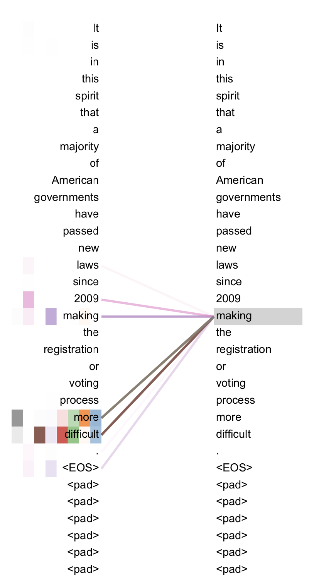 
<center>Ref. 1</center>
</p>

위 그림은 self-attention의 예 로써, 문장 내의 단어끼리 서로 정보를 주고 받는다 (양 옆의 두 문장이 동일). `making [] more difficult` 구문 (해석: [ ] 을 더 어렵게 했다) 에서 `making` 이라는 단어가 자기 자신 `making` 보다도 `more`, `difficult` 라는 단어에 'attention' 했음 을 보여준다. 이는 문법에서 사역동사인 make 자체가 해석상 크게 중요하지 않다는 점을 연상 시킨다.

## Attention

Transformer는 attention을 통하여 정보를 직접적으로 공유한다. 그렇다면 attention을 어떻게 구하고, 정보를 어떻게 공유할까? 

### Attention 이란

하나의 단어 벡터 $q$ (Query) 가 대상 단어 벡터 $k$ (Key) 에게 얼마나 '주목' 하는지 수치화한 값이다. 그리고 수치화 하는 방법은 간단히 두 벡터 간의 내적이다. 

$A(q,k)=q \cdot k$

두 벡터가 유사할수록 내적이 크며, 자신과 유사한 벡터에게 더 큰 가중치 $A$ 를 준다.

### Attention을 이용한 정보 공유

<p align="center"> 
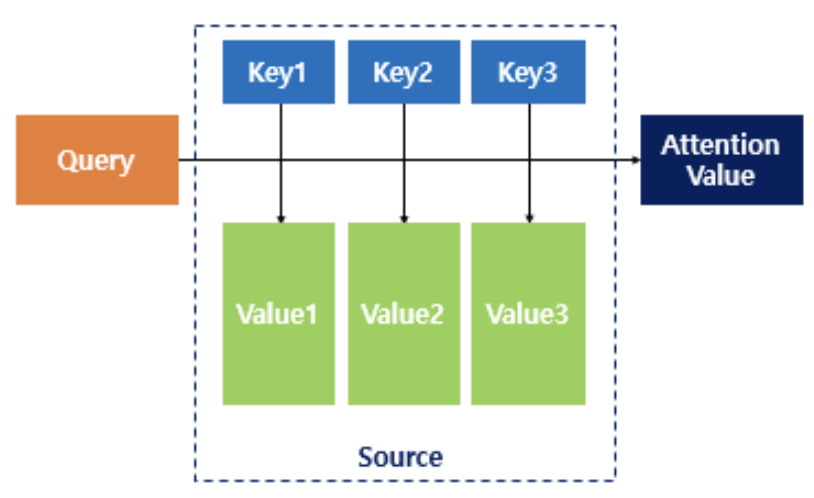 
<center>Ref. 5</center>
</p>

Attention은 위에서 정의한 $A$ 를 이용한다. 먼저, attention을 구하고자 하는 $q$ (Query) 와 다른 모든 대상 벡터 $K=[k_1,k_2,..,k_N]$ (Key) 들에 대한 가중치 $A$ 를 각각 계산한다 $[A_1,A_2,..,A_N]$. 그리고 각 대상 벡터 $v_i=k_i$ (Value) 와 $A_i$간의 일차결합으로 attention 결과 $\hat{q}$ 를 얻는다. 

$$
\hat{q_i}=Attention(q_i,K,V)=(q_i \cdot K) \cdot V=
  \begin{pmatrix}
    A_1 A_2 &..& A_N
  \end{pmatrix}
  \begin{pmatrix}
    v_1 \\
    v_2 \\
	.. \\
	v_N
  \end{pmatrix}
$$

의미는 query가 주목하는 벡터를 더 높은 가중치로 더하여, 정보를 결합한다는 뜻이다.

`making [] more difficult` 예 에서 `making` (query) 는 `more` (key1)와 `difficult` (key2) 에 가장 '주목' 했다. 이는 문법적으로 `make+형용사`가 같은 덩어리로 함께 의미를 갖기 때문에 유사도 (내적) 이 크게 측정 된 것으로 해석된다. 따라서, `making`은 `more`, `difficult` 벡터에 더 큰 가중치를 줘서 더해진다. 즉, attention의 결과는 `making` 의미 뿐만 아니라, `more` 과 `difficult` 의미도 함께 저장하게 된다. 즉, 정보를 공유하는것이다.

### 그 밖에

<p align="center"> 
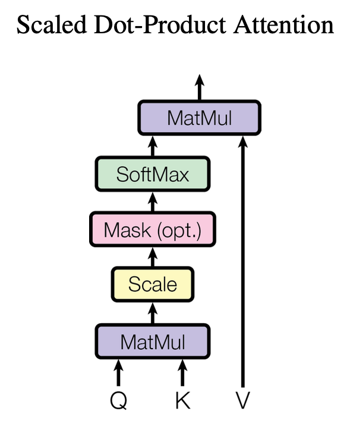 
<center>Ref. 1</center>
</p>

추가적으로, 내적한 값 각각을 `Scale` (normalize) 하고, `Softmax`를 거친다. `Mask (option)` 는 모델 학습 시 `decoder-decoder` self-attention 에만 적용되는 masking 이다 (아래 설명).

<p align="center"> 
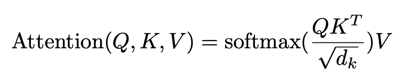 
<center>Ref. 1</center>
</p>

실제 구현에서는, $Q=[q_1,q_2,..q_N]$ 에 대한 attention을 한번에 구하기 위하여 매트릭스 간의 연산을 수행한다. 

그렇다면 위의 예에서, `making`은 자기 자신 `making`과 가장 유사도가 클텐데 어떻게 `more`, `difficult`에 더 큰 가중치를 준것인가? 

### Multi-head attention

실제로 Transformer에서는 조금 더 복잡하게 attention을 계산하고 정보를 공유 한다 (하지만 의미는 위와 크게 다르지 않다).

<p align="center"> 
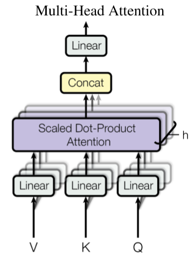 
<center>Ref. 1</center>
</p>

각 $q,k,v$는 attention을 계산하기에 앞서, 서로 다른 linear projection 을 통과한다 ($qw^q,kw^k,vw^v$). 따라서, self-attention ($q=k$)에서 `making` ($q_iw^q$) 이 자기 자신 `making` ($k_iw^k$) 에 가중치를 덜 줄 수 있다.

이와같은 linear projection을 여러개 (default=8) 동시에 사용하는것을 Multi-head attention이라고 한다. 즉, 같은 문장에 대해서도 서로 다른 방식으로 attention을 계산하고, 이 결과들을 통합 (concat+linear projection) 한다는 의미이다.

<p align="center"> 
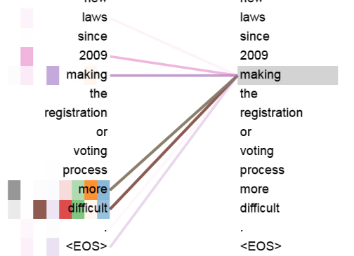 
<center>Ref. 1</center>
</p>

서로 다른 색깔의 선들은 다른 head를 의미함.

## Model architecture

지금까지 Transformer 모델을 구성하는 핵심적인 구성요소 `multi-head attention layer`에 대해 살펴보았다.

Transformer 모델은 크게 encoder와 decoder로 구성되어 있다. 입력으로 문장이 들어가며, 출력으로 다른 문장이 생성된다 (예를 들어, 번역된 문장). 모델의 대부분이 attention으로 구성되어 있다고 해도 과언이 아니다. 다만 attention의 대상이 크게 세가지로 구성된다.

#### encoder-encoder

입력 문장 (encoder) 단어들 간의 self-attention이다. 각 query, key, value는 입력 문장 내의 단어 벡터이다 ($q_i=k_i=v_i$).

#### encoder-decoder

출력 문장 생성 시 (decoder), 입력 문장의 정보를 사용하기 위한 attention이다. query는 출력 문장 (decoder) 내의 단어 벡터 이고, key, value 는 입력 문장 (encoder output) 내의 단어 벡터 이다 ($k_i=v_i$).

#### decoder-decoder

출력 문장 (decoder) 내 단어들 간의 self-attention이다. 학습 시 `encoder-encoder` 와 달리 attention에 masking 이 된다.

### Attention masking

모델 학습 시, 우리는 이미 입력 문장에 대응하는 출력 문장 $[w_1,w_2,..,w_N]$ 을 알고있다. 따라서, 초기 값 $i$를 맨 앞에 붙여서 decoder에 통째로 넣는다 $[i,w_1,w_2,..,w_N]$. 

decoder의 역할은 [$i$ --> $w_1$, $w_1$ --> $w_2$, .., $w_N$ --> END] 매핑이며, $[w_1,w_2,..,w_N,END]$ sequence를 한번에 출력하는것이 목표이다. 

<p align="center"> 
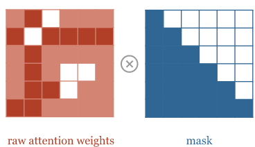 
<center>Ref. 8</center>
</p>

학습 시, 단어 $w_i$ 는 뒤에 나올 모든 단어 ${w_{i+1},..,w_N}$ 에 대해 알아도 모르는 척 해야한다. 그러기 위해서 attention 가중치를 $-\infty$ 로 덮어씌운다 (masking).

$$
A_{ij}=A(w_i,w_j)=-\infty, \; i<j
$$

이후 softmax를 통과하면 $A_{ij}=0$ 이 되어 attention 가중치가 masking 된다. 즉, 뒤에 나오는 단어 정보를 attention 하지 못하도록 한다.

학습 시에는 위와 같이 출력 문장을 통째로 넣어 decoder에서 병렬로 처리 할 수 있어 빠른 학습이 가능하다. 추론 시에는 출력 문장을 모르기 때문에, 초기값 $i$를 넣고 단어 하나하나를 추론하여 END 토큰이 나올때까지 지속되므로 느리다.

### 그 밖에

<p align="center"> 
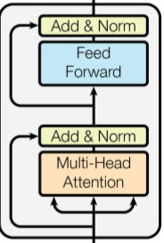 
<center>Ref. 1</center>
</p>

residual connection 과 layer normalization 이 존재하여 attention 전,후 값을 더해준 후 normalization 해준다 (```Add & Norm```). attention 연산 이후 각 단어 벡터에 대한 ```Feed forward``` 가 존재하는데, 이는 1x1 convolution과 같다. 즉, 인접 위치와 독립적으로 연산된다.
```
input1: I am a boy
input2: a I boy am
```
모델 구조를 보면 기존의 언어 모델과는 달리 각 단어간의 순서를 고려하지 않는다는 점이 특징이다. 만약 input 문장의 순서를 뒤죽박죽 섞어서 돌린다해도 결과가 변하지 않을 것이다 (permutation-invariant). 이는 분명 모델 구조의 치명적인 단점일 것이다.

## positional encoding

이를 보완하기 위해, Transformer는 embedding된 입출력 문장의 각 단어 벡터 $w_t$ 에 위치 (position) 를 표시해둔다.

<p align="center"> 
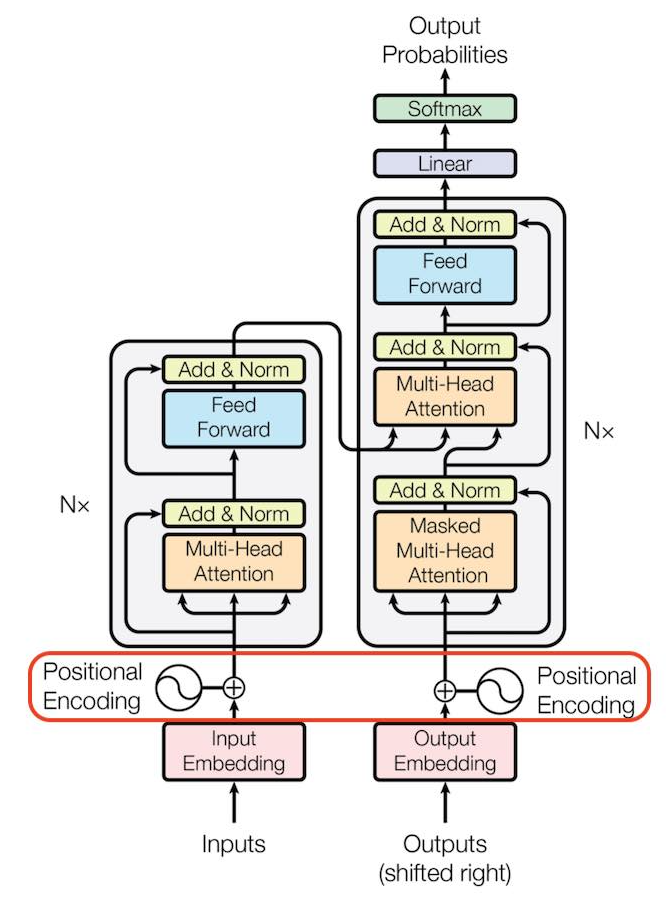 
<center>Ref. 7</center>
</p>

표시하는 방법은 각 단어 벡터에 positional encoding 벡터 $p_t$ 를 더해주는 것이다.

$$
\hat{w_t}=w_t+p_t
$$

positional encoding은 input embedding과 동일한 shape=[문장 길이, 임베딩 차원] 를 가지며, 다음과 같은 값을 가진다.

<p align="center"> 
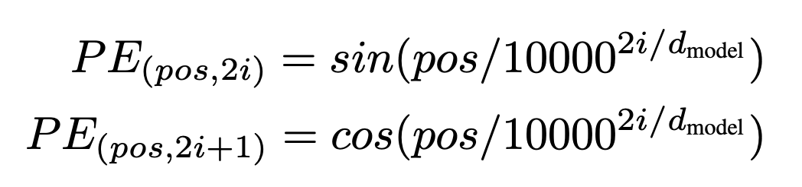 
<center>Ref. 1</center>
</p>

즉, 위치 $pos$ 축을 따라가면 특정 주기의 sin/cos 함수 값을 가지며, 임베딩 $i$ (그림상 d) 축을 따라가면 sin/cos의 파장이 점점 길어진다.

<p align="center"> 
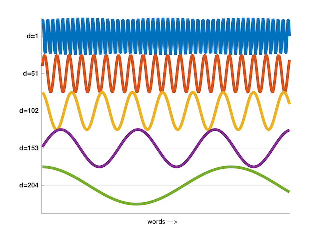 
<center>Ref. 9</center>
</p>

### Why sinusoidal

적절한 positional encoding 이기 위해서는, 각 positional 벡터가 자신의 위치를 정확히 표현하고, 다른 대상 위치와의 관계 (relative position) 를 잘 표현 할 수 있어야 한다. Transformer에서 제안한 positional encoding은 이러한 조건들을 충족할까?

우선, 서로 다른 주기의 sin/cos 함수 배열은 이진법으로 큰 숫자를 표현하는 것과 흡사하다.

<p align="center"> 
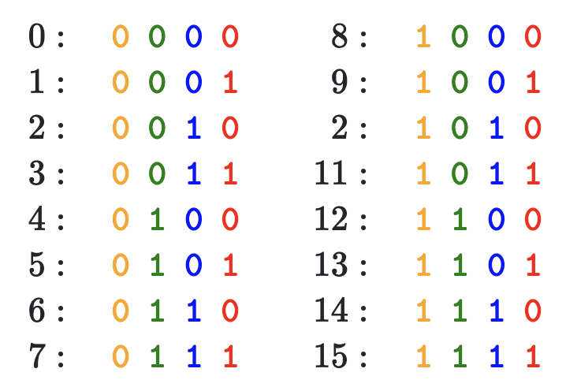 
<center>Ref. 7</center>
</p>

빨간색 숫자는 파장이 짧은 sin/cos 함수에서 표현되고, 점점 파장이 길어져서 노란색 숫자는 파장이 긴 sin/cos 함수에서 표현된다. 따라서, 각 위치 $pos$ 의 positional encoding 벡터 각각은 서로 다른 위치 값을 unique하게 표현 할 수 있다. 추가로 sin/cos 함수 값 범위가 -1~1 이기 때문에, embedding 값을 크게 훼손하지 않는다.

또 하나의 이점은 상대적인 위치 관계를 표현하기 수월하다는 점이다.

<p align="center"> 
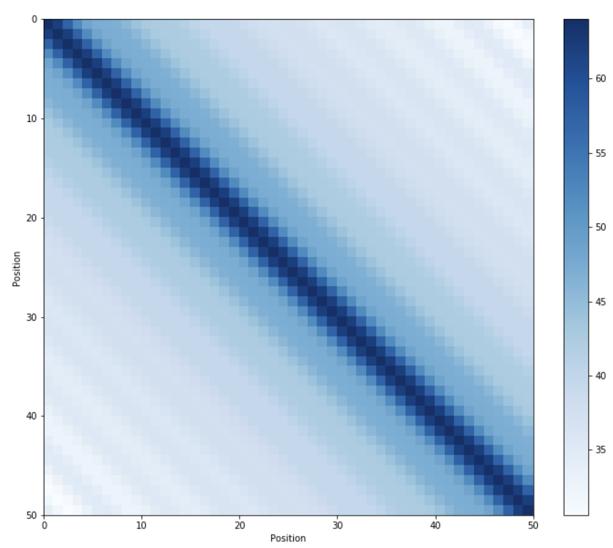 
<center>Ref. 7</center>
</p>

positional encoding 벡터 끼리의 내적 연산에서, 상대적 위치가 멀수록 내적 값이 대칭적으로 줄어드는 것을 볼 수 있다. 직관적으로 거리가 멀수록 attention이 낮게 측정되어야 한다는 점이 잘 표현된다.

또한 sin/cos 함수를 동시에 사용 함으로써, $p_t$ 와 $p_{t+a}$ 사이의 관계를 $t$ 와 관계 없는 행렬 $M$ 로 표현할 수 있다.

$$
M\begin{bmatrix}
	    \sin(t) \\
	    \cos(t)
	\end{bmatrix} = \begin{bmatrix}
	    \sin(t + \phi) \\
	    \cos(t + \phi)
	\end{bmatrix},
$$

$$
  M = \begin{bmatrix}
        \cos(\phi) & \sin(\phi) \\
        - \sin(\phi) & \cos(\phi)
    \end{bmatrix}
$$

따라서 특정 $t$ 와 관계없이 상대적 위치를 attention 하는 $M$ 과 같은 linear projection을 학습하기 쉽다.

## Inference

inference시에는 어쩔수 없이 auto-regressive 방식으로 단어 하나하나를 추론해야한다.

<p align="center"> 
 
<center>Ref. 2</center>
</p>

inference 흐름:

input sequence가 encoder를 통과하면서 단어들간의 정보가 교류된다 `encoder-encoder`. decoder의 입력은 초기 벡터와 함께 encoder output이다. decoder에서 단어 하나하나를 추론하기 위해, 이전 추론 결과 정보 `decoder-decoder` 와 함께 encoder output 정보도 함께 사용된다 `encoder-decoder`. 현재 추론된 단어는 다음 단어 추론의 초기값이 된다.

### non-autoregressive (작성중)

만약 inference 시 이전에 추론한 단어들을 고려하지 않고, 한번에 inference 한다면 어떨까? 즉, ```decoder-decoder``` 를 사용하지 않음을 의미한다. 

이는 주어진 문장 $X$ 을 각자 독방에 갖혀있는 몇명의 번역가들에게 주고, 번역한 문장내 단어 $y_i$ 하나만 말해보라고 하는것과 같을 것이다. 다른 번역가들이 어떤 단어를 말했는지 모르기 때문에, 합쳐진 문장은 아마 중복된 단어들로 이뤄져 있거나 순서가 뒤죽박죽인 문장이 만들어질 것이다.

이러한 경우, 서로 다른 위치의 단어들 $y_1,..,y_N$ 이 주어진 문장 $X$ 에 대해 conditional independent 하다고 한다:

$$
p(y_i,y_j \mid X) = p(y_i \mid X) p(y_j \mid X)
$$

<!-- <p align="center"> 
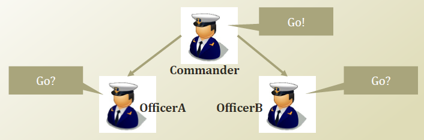 
<center>Ref. 13</center>
</p>

예를 들어, 위 그림과 같이 officerA ($y_i$) 와 officerB ($y_j$) 는 Commander ($X$) 에 대해 conditional independent 이다. 

만약 Commander 의 명령을 모르는 상태에서 officerA 가 officerB=Go 인 상태를 관찰한다면 Commander 의 명령이 있다고 생각하고, officerA=Go 상태가 될 확률이 높아질 것이다. 따라서, officerA 와 officerB 는 서로 독립이 아니다. 

반면 Commander 의 명령을 알고있다면, OfficerB 가 무엇을 하는지에 관계없이 Commander 의 명령에 따르므로 conditional independent 가 된다. -->


## Reference

1. https://arxiv.org/pdf/1706.03762.pdf
2. https://ai.googleblog.com/2017/08/transformer-novel-neural-network.html
3. http://colah.github.io/posts/2015-08-Understanding-LSTMs/
4. https://medium.com/@adityathiruvengadam/transformer-architecture-attention-is-all-you-need-aeccd9f50d09
5. https://wikidocs.net/22893
6. http://jalammar.github.io/illustrated-transformer/
7. https://kazemnejad.com/blog/transformer_architecture_positional_encoding/
8. http://www.peterbloem.nl/blog/transformers
9. https://ricardokleinklein.github.io/2017/11/16/Attention-is-all-you-need.html
10. http://www.davidsbatista.net/blog/2020/01/25/Attention-seq2seq/
11. https://arxiv.org/pdf/1711.02281.pdf
12. bishop, pattern recognition and machine learning
13. https://actruce.com/conditional-independence/

<!-- # 응용

OCR 모델에 Transformer를 적용했다.

## 배경

RNN 모델과 달리 Transformer는 sequence 내의 특정 부분의 정보를 바로 얻을수있다. OCR의 경우 global (context) 정보 보다는 각 문자가 존재하는 local 정보가 더욱 중요하기 때문에 Transformer를 사용했다. 결과적으로, 이미지 내의 긴 sequence의 문자열도 생성할수 있다.

## Model architecture

CNN + Transformer: shallow CNN을 통해 이미지의 feature를 얻고 이를 flat 하여 Transformer의 입력으로 사용한다. Transformer의 구조는 위와 동일하다. 출력은 이미지에 나와있는 텍스트가 추출된다.

Transformer encoder에서는 각 위치간의 visual feature (문자의 형태) 정보가 공유된다 (encoder-encoder attention). Transformer decoder에서는 visual feature 들의 정보 (encoder-decoder attention)를 바탕으로, 이미지 내의 텍스트를 추론하게 된다. 이때 decoder-decoder attention 으로 부터, 이전에 추론된 문자들의 linguistic feature 정보 또한 사용하게 된다.

## Attention visualization

<kbd>

</kbd> -->

