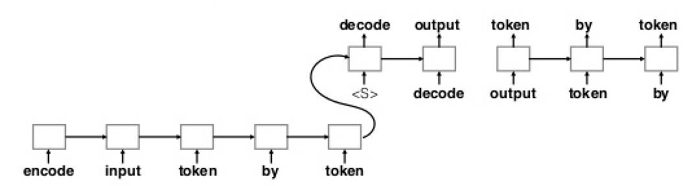
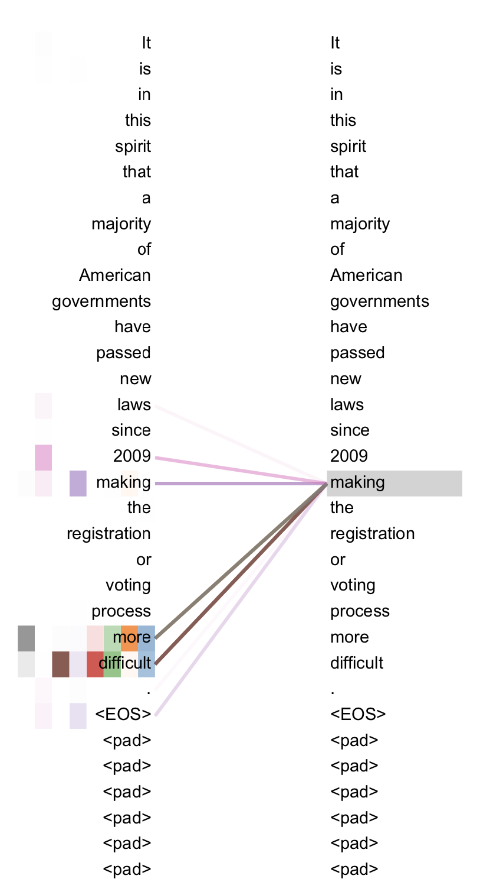
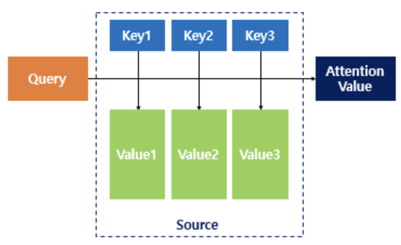
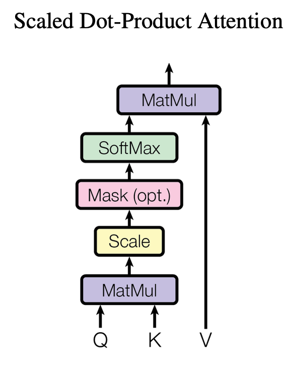
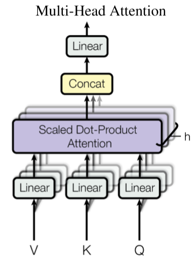
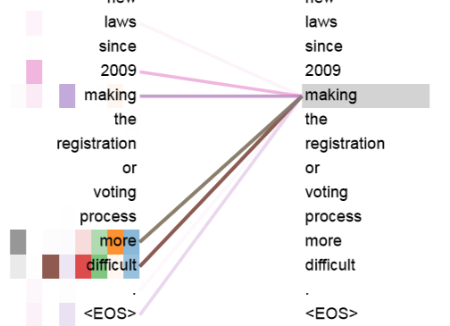
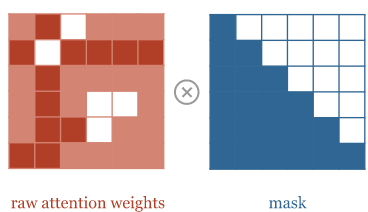
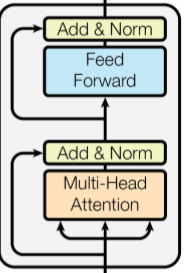

# Transformer

## 소개

Transformer는 RNN과 같이 반복되는 (recurrence) 구조를 사용하지 않고, attention mechanism에 의존하는 모델 구조이다.

Attention 뜻: 주의 (집중), 주목, 관심, 흥미

## 배경

RNN을 사용하는 seq2seq 모델들의 문제는, encoder의 output이 하나의 hidden vector라는 것이다. 따라서, 모든 input sequence 정보를 하나의 vector에 저장해야하는 문제를 갖는다.

<kbd>

</kbd>

기존의 attention mechanism은, decoder에서 encoder의 특정 hidden state에 주목 할 수 있도록 하여 이 문제를 해결한다 `encoder-decoder`. Transformer는 이를 더 확장하여, `encoder-encoder`, `decoder-decoder` 간에도 서로의 정보를 사용할 수 있도록 했다. 

여기서, `encoder-encoder` 그리고 `decoder-decoder` attention을 **self-attention** 이라 한다. 즉, 주어진 sequence 내의 단어끼리도 정보를 주고 받는다.

<kbd>

</kbd>

Self-attention의 예 (양 옆의 두 문장이 동일하므로 self 이다). `making [] more difficult` 구문 (해석: [ ] 을 더 어렵게 했다) 에서 `making` 이라는 단어가 자기 자신 `making` 보다도 `more`, `difficult` 라는 단어에 'attention' 했음 을 보여준다. 이는 문법에서 사역동사인 make 자체가 해석상 크게 중요하지 않다는 점을 연상 시킨다.

## Attention

Transformer는 attention을 통하여 정보를 직접적으로 공유한다. 그렇다면 attention을 어떻게 구하고, 정보를 어떻게 공유하는가? 

### Attention 이란

하나의 단어 벡터 $q$ (Query) 가 대상 단어 벡터 $k$ (Key) 에게 얼마나 '주목' 하는지 수치화한 값이다. 그리고 수치화 하는 방법은 간단히 두 벡터 간의 내적이다. 
$$
A(q,k)=q \cdot k
$$
두 벡터가 유사할수록 내적이 크며, 자신과 유사한 벡터에게 더 큰 가중치 $A$ 를 준다.

### Attention을 이용한 정보 공유

<kbd>

</kbd>

Attention은 위에서 정의한 $A$ 을 이용한다. 먼저, attention을 구하고자 하는 $q$ (Query) 와 다른 모든 대상 벡터 $K=[k_1,k_2,..,k_N]$ (Key) 들에 대한 가중치 $A$ 를 각각 계산한다 $[A_1,A_2,..,A_N]$. 그리고 각 대상 벡터 $v_i=k_i$ (Value) 와 $A_i$간의 일차결합으로 attention 결과 $\hat{q}$ 를 얻는다. 
$$
\hat{q_i}=Attention(q_i,K,V)=(q_i \cdot K) \cdot V
$$
의미는 query가 주목하는 벡터를 더 높은 가중치로 더하여, 정보를 결합한다는 뜻이다.

`making [] more difficult` 예 에서 `making` (query) 는 `more` (key1)와 `difficult` (key2) 에 가장 '주목' 했다. 이는 문법적으로 `make+형용사`가 같은 덩어리로 함께 의미를 갖기 때문에 유사도 (내적) 이 크게 측정 된 것으로 해석된다. 따라서, `making`은 `more`, `difficult` 벡터에 더 큰 가중치를 줘서 더해진다. 즉, attention의 결과는 `making` 의미 뿐만 아니라, `more` 과 `difficult` 의미도 함께 저장하게 된다. 즉, 정보를 공유하는것이다.

### 그 밖에

<kbd>

</kbd>

추가적으로, 내적한 값 각각을 `Scale` (normalize) 하고, `Softmax`를 거친다. `Mask (option)` 는 모델 학습 시 `decoder-decoder` self-attention 에만 적용되는 masking 이다 (아래 설명).

<kbd>

</kbd>

실제 구현에서는, $Q=[q_1,q_2,..q_N]$ 에 대한 attention을 한번에 구하기 위하여 매트릭스 간의 연산을 수행한다. 

그렇다면 위의 예에서, `making`은 자기 자신 `making`과 가장 유사도가 클텐데 어떻게 `more`, `difficult`에 더 큰 가중치를 준것인가? 

## Multi-head attention

실제로 Transformer에서는 조금 더 복잡하게 attention을 계산하고 정보를 공유 한다 (하지만 의미는 위와 크게 다르지 않다).

<kbd>

</kbd> 

각 $q,k,v$는 attention을 계산하기에 앞서, 서로 다른 linear projection 을 통과한다 ($qw^q,kw^k,vw^v$). 따라서, self-attention ($q=k$)에서 `making` ($q_iw^q$) 이 자기 자신 `making` ($k_iw^k$) 에 가중치를 덜 줄 수 있다.

이와같은 linear projection을 여러개 (default=8) 동시에 사용하는것을 Multi-head attention이라고 한다. 즉, 같은 문장에 대해서도 서로 다른 방식으로 attention을 계산하고, 이 결과들을 통합 (concat+linear projection) 한다는 의미이다.

<kbd>

</kbd> 

서로 다른 색깔의 선들 각각은 다른 head를 의미함.

## Model architecture

지금까지 Transformer 모델을 구성하는 핵심적인 구성요소 `multi-head attention layer`에 대해 살펴보았다.

Transformer 모델은 크게 encoder와 decoder로 구성되어 있다. 입력으로 문장이 들어가며, 출력으로 다른 문장이 생성된다 (예를 들어, 번역된 문장). 모델의 대부분이 attention으로 구성되어 있다고 해도 과언이 아니다. 다만 attention의 대상이 크게 세가지로 구성된다.

#### encoder-encoder

입력 문장 (encoder) 단어들 간의 self-attention이다. 각 query, key, value는 입력 문장 내의 단어 벡터이다 ($q_i=k_i=v_i$).

#### encoder-decoder

query는 출력 문장 (decoder) 내의 단어 벡터 이고, key, value 는 입력 문장 (encoder output) 내의 단어 벡터 이다 ($k_i=v_i$).

#### decoder-decoder

출력 문장 (decoder) 내 단어들 간의 self-attention이다. 하지만 `encoder-encoder` 와 달리 attention에 masking 이 된다.

### Attention masking

모델 학습 시, 우리는 이미 input sequence에 대응하는 output sequence $[w_1,w_2,..,w_N]$ 를 알고있다. 따라서, 초기 값 $i$를 맨 앞에 붙여서 decoder에 통째로 넣는다 $[i,w_1,w_2,..,w_N]$. 

decoder의 역할은, $[i->w_1, w_1->w_2,..,w_N->END]$ 매핑을 추론하여 $[w_1,w_2,..,w_N,END]$ sequence를 한번에 출력하는것이 목표이다. 

<kbd>

http://www.peterbloem.nl/blog/transformers
</kbd>

이때, $w_i$를 추론하는데에 $w_j$의 정보를 사용하지 못하도록 $i<j$ 하기 위해 attention 값을 $-\inf$으로 masking 한다. 이후, softmax를 통과하면 $exp(-inf)=0$ 이 되어 attention이 masking 되므로 정보를 사용하지 못한다.

학습 시에는 위와 같이 decoder에서 병렬로 처리 할수 있어 빠르지만, 추론 시에는 초기값 $i$를 넣고 auto-regressive 방식으로 추론하며 $END$ 토큰이 나올때까지 지속되므로 속도가 느리다.

### 그 밖에

<kbd>

</kbd>

residual connection 과 layer normalization 이 존재하여 attention 전,후 값을 더해준 후 normalization 해준다 (```Add & Norm```). attention 연산 이후 각 단어 벡터에 대한 ```Feed forward``` 가 존재하는데, 이는 1x1 convolution과 같다. 즉, 인접 위치와 독립적으로 연산된다.
```
input1: I am a boy
input2: a I boy am
```
모델 구조를 보면 기존의 언어 모델과는 달리 각 단어간의 순서를 고려하지 않는다는 점이 특징이다. 만약 input 문장의 순서를 뒤죽박죽 섞어서 돌린다해도 결과가 변하지 않을 것이다 (permutation-invariant). ~~~이는 분명 모델 구조의 치명적인 단점일 것이다.~~~

## positional encoding

https://kazemnejad.com/blog/transformer_architecture_positional_encoding/

그림

이를 보완하기 위해, Transformer는 embedding 변환 이후 각 단어 embedding에 순서를 표시해둔다. 순서를 표시하는 방법은 positional encoding을 더해주는것이다. positional encoding은 주기함수 sin,cos 값을 넣어준다.

하필 sin, cos을 사용한 이유는 아마도 값이 -1~1 경계를 갖기 때문에 embedding 값 자체에 너무 크게 영향을 주지 않는다.

모델이 각 단어 embedding에 대해 독립적으로 연산을 한다 해도 어느부분에 속하는지 알도록 한다.

## Inference

inference시에는 어쩔수 없이 auto-regressive 방식으로 단어 하나하나를 추론해야한다.

<kbd>

https://ai.googleblog.com/2017/08/transformer-novel-neural-network.html
</kbd>

inference 흐름:

input sequence가 encoder를 통과하면서 단어들간의 정보가 교류된다 `encoder-encoder`. decoder의 입력은 초기 벡터와 함께 encoder output이다. decoder에서 단어 하나하나를 추론하기 위해, 이전 추론 결과 정보 `decoder-decoder` 와 함께 encoder output 정보도 함께 사용된다 `encoder-decoder`. 현재 추론된 단어는 다음 단어 추론의 초기값이 된다.

그림

만약 inference를 이전 단어를 무시하고, 한번에 해버린다면 어떻게 될까? 이는 주어진 문장을 각자 독방에 갖혀있는 몇명의 번역가들에게 주고, 번역한 문장내 단어중 하나씩만 말해보라고 하는것과 같을 것이다. 합쳐진 문장은 아마 중복된 단어들로 이뤄져 있거나 의미가 없는 문장이 만들어질것이다.

non auto-regressive 방식에 대한 연구들이 많이 있지만, 여기서는 다루지 않는다.

지금까지 Transformer에서 중요한 개념들을 설명했다. 아래에는 Transformer를 적용한 응용 사례에 대해 기술했다.

# 응용

OCR 모델에 Transformer를 적용했다.

## 배경

RNN 모델과 달리 Transformer는 sequence 내의 특정 부분의 정보를 바로 얻을수있다. OCR의 경우 global (context) 정보 보다는 각 문자가 존재하는 local 정보가 더욱 중요하기 때문에 Transformer를 사용했다. 결과적으로, 이미지 내의 긴 sequence의 문자열도 생성할수 있다.

## Model architecture

CNN + Transformer: shallow CNN을 통해 이미지의 feature를 얻고 이를 flat 하여 Transformer의 입력으로 사용한다. Transformer의 구조는 위와 동일하다. 출력은 이미지에 나와있는 텍스트가 추출된다.

Transformer encoder에서는 각 위치간의 visual feature (문자의 형태) 정보가 공유된다 (encoder-encoder attention). Transformer decoder에서는 visual feature 들의 정보 (encoder-decoder attention)를 바탕으로, 이미지 내의 텍스트를 추론하게 된다. 이때 decoder-decoder attention 으로 부터, 이전에 추론된 문자들의 linguistic feature 정보 또한 사용하게 된다.

## Attention visualization

<!-- <kbd>

</kbd> -->

