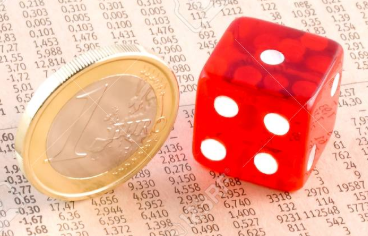

이 포스트는 pattern recognition and machine learning (Bishop) chapter 11. sampling methods 를 기반으로 작성 되었습니다.

### Random 이란?

<p align="center"> 
 
<center>Ref. 5</center>
</p>

# Basic sampling

“What is sampling? `Sampling` is the act, process, or technique of selecting a suitable sample, or a `representative` part of a population for the purpose of determining parameters or `characteristics` of the whole `population`.”

샘플링은 전체 집단의 대표적인 부분을 선택하는 방법으로써, 전체 집단의 특성을 결정하는 목적으로 사용된다. 

예를 들어, 전세계의 남자/여자 분포를 모른다면, 각국의 사람들을 골고루 뽑아 남녀가 나온 횟수를 비교해보면 전세계 남녀 분포를 가늠해볼 수 있다. 

또한, 함수 $f(z)$ 의 기대값을 계산하기 어려운 경우, 샘플링을 통해 얻은 값 $z_1,z_2,..,z_L$ 으로 대략적인 평균값을 구해볼수도 있다:

$$
\begin{aligned}
E(f)&=\int{p(z)f(z)dz} \\ \\
&\approx \frac{1}{L}\sum_{i=1}^{L}{f(z_i)} \\
\end{aligned} 
$$

따라서, 샘플링은 원하는 (전체 집단) 분포 $p$ 로 부터, (대표적인) 샘플 $z_1,z_2,..,z_N$ 을 생성하는것이다:

$$
z \sim p(z)
$$ 

특히 관심을 갖는 $z$ 는 고차원 샘플이다. 

고차원 분포 $p(z)$ 를 알고 있다면, 우리는 특정 $z_0$ 에 대한 $p(z_0)$ 의 값을 쉽게 계산할수 있다. 그럼에도 $p$ 로 부터 샘플을 추출하는것은 간단하지 않다.

샘플링에는 몇가지 방법들이 있는데, 우선 uniform(0,1) 로 부터 pseudo-random number를 생성할 수 있다고 가정한다.

### 딥러닝을 이용한 이미지 (고차원 데이터) 샘플링

<p align="center"> 
 
<center>Ref. 2</center>
</p>

Generative adversarial network (GAN)은 비교적 최근 고안된 이미지 생성 기법이다. uniform 분포로 부터 샘플된 랜덤 노이즈 $z$ 를 입력으로 하여, 학습된 네트워크 Gererator $G$ 를 통과하면 랜덤한 이미지 $\hat{x}$ 가 생성된다. 네트워크는 $z$ 에서 $\hat{x}$ 로 매핑되는 함수 $G(z)=\hat{x}$ 를 학습한다 (이때, 랜덤변수 $z$ 에 의해 생성된 이미지 $\hat{x}$ 도 랜덤변수 이다).

주목할 점은, Generator의 학습을 돕기위해 Discriminator $D$ 라는 또 다른 네트워크도 함께 학습한다. $D$ 의 역할은 $G$ 가 생성한 이미지 $\hat{x}$ 와 실제 이미지 $x$ 중 어떤 것이 실제 이미지 인지를 구별하는데, 만약 구별이 너무 쉽다면 $G$ 를 혼내준다 (?!). 즉, $G$ 가 실제 이미지와 구별하기 힘든 그럴싸한 생성 이미지를 만들도록 강제한다. 

$G$ 와 $D$ 간의 대립, 경쟁 (adversarial) 을 모델링한 loss 함수 덕분에, 매우 그럴싸한 생성 이미지를 만들어낸다. 만약 $D$ 가 없어서 $G$ 가 경쟁을 하지 않는다면, 이미지와 같은 고차원의 샘플을 그럴싸하게 만들기 전에 대충 만들어 버리는 것에 안주 할지 모른다.

## 기본적인 샘플링 방법

원하는 분포 $p$ (desired distribution) 가 복잡하여, 샘플을 직접 추출하는것이 불가능한 경우 사용할 수 있는 방법들이다.

## Transformation technique

쉽게 샘플링 할 수 있는 분포 $q$ 에서 추출한 샘플 $z \sim q(z)$ 을 변환하여 (transformation):

$$
G(z)=x
$$

원하는 분포 $p$ 의 샘플 $x \sim p(x)$ 을 얻는 방식이다. 앞서 봤던 GAN이 이 방법으로 이미지를 생성한다. 

<p align="center"> 
 
<center>Ref. 1</center>
</p>

GAN (Generator vs Discriminator) 이 경쟁적으로 학습되는 과정. 

검은색 점선은 실제 이미지 $x$ 분포, 초록색 선은 생성된 이미지 $\hat{x}$ 분포, 파란색 점선은 Discriminator $D$ (값이 클수록 실제라고 판단) 이다. $z$ 에서 $x$ 로 가는 화살표들은, $G$ 에 의한 랜덤변수 $z$ 의 transformation 을 나타낸다.

- (a): uniform 분포에서 샘플링한 $z$ 가, 학습되기 전 네트워크 $G_0$ 에 입력됨. 생성된 이미지 $G_0(z)=\hat{x}$ 는 실제 이미지 $x$ 와 같은 domain 에서 분포를 갖지만, 실제 이미지와는 거리가 멀다 (초록선과 검은점선의 거리가 멈).
- (b): Discriminator $D$ 가 실제와 생성 이미지를 구분하도록 학습됨 (파란점선의 값으로 초록선과 검은점선을 구분할 수 있음).
- (c): $D$ 가 쉽게 구분하지 못하도록, $G$ 는 실제 이미지와 유사한 이미지를 생성하도록 학습됨 (초록선과 검은점선의 거리가 가까워짐).
- (d): 학습이 충분히 되어 $z \rightarrow x$ 의 transformation 함수 $G$ 를 찾아내면, 생성 이미지 $G(z)=\hat{x}$ 는 실제 이미지와 유사해짐 (파란점선이 초록선과 검은점선을 더 이상 구분할 수 없음).

많은 학습 데이터와 강력한 컴퓨팅 파워를 바탕으로, GAN 은 이미지와 같은 고차원 데이터를 샘플링 할 수 있음을 보였다. 

그러나 고차원에서 고차원으로 매핑하는 매우 복잡한 transformation 함수 $G: z \rightarrow x$ 를 성공적으로 학습시키기는 여전히 쉽지 않다.

## Rejection sampling

마찬가지로 쉽게 샘플링 할 수 있는 분포 (proposal distribution)에서 샘플을 추출한다. 하지만, 이번에는 몇몇 샘플들이 거부 (reject) 될 수 있다.

또한, 원하는 분포 $p$ 를 normalize 하기 전인 $\tilde{p}$ 까지만 안다고 해도 ($Z_p$ 를 계산할 수 없어서), 샘플링이 가능하다:

$$
p(z)=\frac{1}{Z_p}\tilde{p}(z)
$$

즉, 모든 $z$ 에 대해서 $\tilde{p}(z)$ 만 계산할 수 있으면 rejection sampling 을 사용할 수 있다.

Rejection sampling 에 앞서 rejection 이 확률에 미치는 예를 보자.

<p align="center"> 
 
</p>

```
주사위를 던졌을 때의 값 1~6 을 uniform 샘플링 하고자 한다. 하지만 우리에게 주사위는 없고 동전 하나만 가지고 있다고 하자. 

동전을 세번 던져서 나오는 세 쌍 (예를 들어, 앞-앞-앞)의 모든 경우의 수는 8개 이다. 여기서 앞-앞-앞 과 뒤-뒤-뒤 가 나오는 경우를 거부 (rejection) 하고 다시 던지도록 하면 총 6가지 경우만 남는다. 6가지 각각에 값 1~6 을 매핑하면 주사위 값을 샘플링 하는 것과 같다.
```

즉, rejection 은 일어날 수 있는 event 를 무시함으로써 다른 event 들의 확률을 높인다.

### Rejection sampling 알고리즘

원하는 분포 $p(z)$ 에 대해 다음을 선택한다:
- 직접 샘플링 가능한 분포 proposal distribution $q(z)$
- 모든 $z$ 에 대해, $\tilde{p}(z) \leq kq(z)$ 를 만족하는 상수 $k$

알고리즘:
1. $z_0 \sim q(z)$ ($z_0$ 샘플링)
2. $u_0 \sim uniform(0,kq(z_0))$ ($u_0$ 샘플링)
3. 만약 $u_0 \leq \tilde{p}(z_0)$ 이면 $(z_0,u_0)$ 저장, 아니면 버림


<p align="center"> 
 
<center>Ref. 1</center>
</p>

위 그림의 회색 부분 $\tilde{p}(z_0) < u_0$ 의 $(z_0, u_0)$ 쌍은 버려지며, 저장된 $(z_0,u_0)$ 는 $\tilde{p}(z)$ 그래프 아래에서 균일하게 분포한다. 따라서, 알고리즘으로 생성된 $z_0$ 들은 원하는 $p(z)$ 분포를 따라 생성된다. 왜냐하면 $p(z)$ 가 큰 $z$ 일수록 저장될 가능성이 커서, 더 많이 저장되기 때문이다 (증명은 Ref. 1, Exercise 11.6 참고).

이 알고리즘으로 샘플링이 가능한 이유는 $p$ 에서 직접 샘플 추출은 어려울지라도, 특정 $z_0$ 에서 $\tilde{p}(z_0)$ 을 계산하는것은 가능하기 때문이다.

### Acceptance 확률

rejection sampling 으로 $z_0$ 가 저장 (샘플링) 될 확률은 $q$ 에서 $z_0$ 가 뽑히면서, 동시에 $u_0 \leq \tilde{p}(z)$ 이여서 $(z_0,u_0)$ 가 reject 되지 않을 확률이다:

$$
P(\text{accept}\mid z_0)q(z_0)
$$

따라서, 모든 $z$ 에 대한 accept 확률은 다음과 같다:

$$
\begin{aligned}
P(\text { accept }) &= \int{P(\text{accept}\mid z)q(z) }dz \\ \\
&=\int{[\tilde{p}(z) / k q(z)]} q(z) dz \\ \\ 
&=\frac{1}{k} \int {\tilde{p}(z)} dz \\
\end{aligned}
$$

accept 확률과 $k$ 는 반비례 한다. 여기서 $\tilde{p}(z)$ 는 주어지는 것이고, $k$ 를 최대한 작게 선택해야 accept 확률을 높일 수 있다. 단, 모든 $z$ 에서 $\tilde{p}(z) \leq kq(z)$ 를 만족해야 rejection sampling 을 사용할 수 있다.

### 한계

문제는 $k$ 를 최소한으로 선택한다고 해도, 샘플링 하고자 하는 $z$ 의 차원이 크면 accept 가능성은 기하급수적으로 감소한다:

<p align="center"> 
 
<center>Ref. 6</center>
</p>

예를 들어, 원하는 분포 $p$ 가 다변량 가우시안 분포 $N(0,\sigma_p^2 I)$ 를 따른다고 하고, 운 좋게 proposal distribution $q$ 를 동일하게 다변량 가우시안 분포 $N(0,\sigma_q^2 I)$ 로 정했다고 하자 $(\; \sigma_p^2 \neq \sigma_q^2\;)$. 이때, 가우시안의 꼬리 (tail) 에서도 항상 $p(z) \leq kq(z)$ 인 $k$ 가 존재하기 위해서는 반드시 $\sigma_q^2 > \sigma_p^2$ 이여야 한다 (왜냐하면 상수곱으로 지수적 차이를 극복할 수 없으므로).

그리고 $p(0) \leq kq(0)$ 인 $k$ 를 찾으면, 모든 $z$ 에서 $p(z) \leq kq(z)$ 이다. 즉, 최적의 $k$ 는

$$
\begin{aligned}
\text{optimal } k &= \frac{p(0)}{q(0)} = \frac{\Sigma_q}{\Sigma_p} = \left(\frac{\sigma_q^2}{\sigma_p^2}\right)^D.

\end{aligned}
$$

$\sigma_q^2 > \sigma_p^2$ 이기 때문에, $k$ 의 값이 차원 $D$ 에 따라 기하급수적으로 증가하며, 그에 따라 샘플이 reject 될 가능성 또한 기하급수적으로 증가한다. 이 예제와 달리 원하는 분포와 proposal distribution 이 다르다면 더욱 reject 가능성이 커질 것이다. 

따라서, rejection sampling 은 고차원의 데이터를 샘플링하는데에는 매우 비효율적이다.

# Markov chain Monte carlo (MCMC)

<p align="center"> 
 
<center>Ref. 4</center>
</p>

MCMC는 고차원의 데이터도 샘플링 할 수 있는 방법 이다.

원하는 분포 $p$ 가 복잡하여 직접 샘플링이 불가능한 경우 사용하며, rejection sampling과 같이 직접 샘플 추출 가능한 proposal distribution $q$ 에서 샘플링을 한다. 하지만 차이점은 샘플링했던 값 $z_t$을 기준으로 다음 샘플 $z_{t+1}$ 을 추출 한다는 점이다:

$$
z \sim q(z_{t+1} \mid z_t)
$$

이런 방식으로 샘플링한 sequence $z_1,z_2,..,z_t$ 는 `Markov chain` 을 이룬다고 한다.

<p align="center"> 
 
</p>

의문점은 이런식으로 얻은 샘플 $z \sim q(z|z_t)$ 들은 원하는 분포 $p$ 에서 얻은 샘플이 아니라는 것이다. 그러나 Markov chain이 원하는 분포 $p$ 에 대해 특정 조건들을 만족하면, 얼마 후 $p$ 를 따르게 된다.

특정 조건에 대해 설명하기 앞서, MCMC 방법 중 하나를 먼저 보자.

### Metropolis algorithm

Metropolis algorithm 는 MCMC 방법 중 하나이다. 마찬가지로 normalize 하기 전 원하는 분포 값 $\tilde{p}(z)$ 을 계산할 수 있다면, 샘플링이 가능하다.

proposal distribution 에서 '후보' 샘플 $z^{\star} \sim q(z^{\star} \mid z_t)$ 을 추출하는데, 후보 $z^{\star}$ 는 아래 $A$ 의 확률에 따라 샘플로써 저장될 수도 있고 버려질 수도 있다:

$$
A(z^{\star},z_t) = min\left(1, \frac{\tilde{p}(z^{\star})}{\tilde{p}(z_t)}\right).
$$

수식을 자세히 보면, 새롭게 샘플링된 값 $z^{\star}$ 에서의 원하는 분포 값 $\tilde{p}(z^{\star})$ 이 클수록 저장 될 가능성 $A$ 이 커지며, $\tilde{p}(z^{\star}) \geq \tilde{p}(z_t)$ 이면 100% 저장된다. 직관적으로, 원하는 분포의 확률이 큰 샘플 $z^{\star}$ 을 선호 하는것이 자연스럽다.

만약 proposal distribution $q$ 가 positive 이고 symmetric 이면:
- $q(z_A \mid z_B) = q(z_B \mid z_A)$ (symmetric)
- $q(z_A \mid z_B) > 0$, for all $z_A, z_B$ (positive)

Markov chain 의 샘플 $z$ 는 얼마 후 원하는 분포 $p(z)$ 를 따르게 된다.

<p align="center"> 
 
<center>Ref. 1</center>
</p>

Metropolis algorithm 의 Markov chain 을 따라 원하는 분포 $p$ 의 샘플을 추출하려는 동선. 검은색 타원은 원하는 분포 $p(z) = N(\mu,\Sigma)$ 의 one standard-deviation contour 이다.

proposal distribution $q(z^{\star} \mid z_t) = N(z_t,\sigma^2I)$ 는 현재 위치 $z_t$ 를 기준으로 후보 샘플 $z^{\star}$ 을 생성하며, 확률 $A$ 에 따라 $z^{\star}$ 가 accept (초록색 선) 혹은 reject (빨간색 선) 된다.

그림에서 보듯 $z^{\star}$ 가 원하는 분포 $p$ 의 contour를 벗어나면 reject (빨간색 선) 되는 경우가 많은데, 이는 $p(z^{\star}) < p(z_t)$ 이기 때문에 accept 확률 $A$ 가 작아지기 때문이다.

## Markov chain

Markov chain 이 원하는 분포 $p$ 로 수렴하기 위한 조건에 대해 설명하고자 한다. 그에 앞서 Markov chain 의 일반적인 특성에 대해 조금 더 알아보자.

(first-order) Markov chain 은 연속적인 랜덤 변수들 $z_1,z_2,..z_m$ 로 정의되며, 이전 시간에 일어난 사건 $z_{t-1}$ 에 대해서만 현재 어떤 사건 $z_t$ 이 일어날지 결정되는 확률 모델이다: 

$p(z_t \mid z_1,z_2,..,z_{t-1}) = p(z_t \mid z_{t-1})$.

또한, 특정 Markov chain 의 랜덤 변수들 $z_1,z_2,..z_m$ 은
- 초기 확률 분포: $p_0(z)$
- 전이 확률 분포: $T(z_t,z_{t+1}) \equiv p(z_{t+1} \mid z_t)$
  - Metropolis algorithm 의 proposal distribution $q(z^{\star} \mid z_t)$

에 따라 결정 된다.

### Markov chain in discrete states

Markov chain 이 이산적인 상태 공간에서 어떻게 생성되는지 살펴보자.

#### 예제 1

<p align="center"> 
 
</p>

위 그림에서 $z$ 의 가능한 상태는 ${s_1,s_2,s_3}$ 총 세개 이며, 초기 확률분포 $p_0(z)$ 그리고 전이 확률 $P$ 로 정의된 Markov chain 이다. 전이 확률 $P$ 행렬의 i행, j열 은 $s_i$ 에서 $s_j$ 로 이동할 확률을 나타낸다:

$$
P_{ij}=P(z_{t+1}=s_j \mid z_t=s_i)
$$

그렇다면 $n$ 번 이동을 한 후의 확률 분포 $p_n(z)$ 는 어떻게 될까? 

$p_n(z)=p_0(z) \times P \times .. \times P \approx [0,0,1]$

$p_n(z) = [0,0,1]$ 에 점점 가까워진다. 즉, 특정 분포 (stationary distribution) 에 수렴 한다. 또한, 다른 초기 상태 $p_0(z)$ 에서 시작한다고 하더라도 동일한 stationary 분포에 수렴하는 것을 확인할 수 있다.

사실 이 간단한 예에서 상태 $s_3$ 는 머물 확률이 1 (absorbing state) 이기 때문에, 어떤 상태에서 출발해도 s3에 갇히게 된다 (absorbing Markov chain).

#### 예제 2

<p align="center"> 
 
<center>Ref. 7</center>
</p>

위 그림의 가능한 상태 $S$ 은 두개이며, 마찬가지로 초기확률 $P_0$ 와 전이확률 $T$ 에 의해 Markov chain 이 정의된다. 또한 전이확률 $T$ 에 의해 특정 분포 $p^{\star}(z)=[0.3636.., 0.6363..]$ 로 점차 수렴하는 것을 확인할 수 있으며, 초기 확률 분포와 관계없이 동일한 $p^{\star}$ 로 수렴하는 것을 계산해볼 수 있다.

따라서 Markov chain 이 원하는 분포로 수렴하도록 설계하면, 얼마 후 원하는 분포로 부터 샘플들을 계속 얻을 수 있을 것이다. 그렇다면 어떤 조건일때, 초기 확률 분포와 무관하게 특정 분포로 수렴하게 될까?

### Markov chain in general

만약 모든 시간 $t$ 에서 전이 확률이 동일하다면, 그 Markov chain을 (time) ```homogeneous``` 라 한다. homogeneous Markov chain 의 특징은 $t \rightarrow \infty$ 일때, 초기 확률분포 $P_0$ 에 관계없이 unique stationary 분포로 수렴한다는 것이다.

만약 Markov chain 에 의해 특정 분포 $p^{\star}(z)$ 가 바뀌지 않는다면, $p^{\star}$ 는 그 Markov chain에 대해 ```invariant``` (stationary) 분포라고 한다.

$$
p^{\star}(z_{t+1})=\sum_{z_t}{T(z_t,z_{t+1})p^{\star}(z_t)}
$$

$p^{\star}$ 가 invariant 분포가 아니라면, 전이 확률 $T$ 에 의해 분포가 변할 것이다. 

전이 확률이 동일한 homogeneous Markov chain 이라면, invariant 분포 $p^{\star}$ 는 바뀌지 않을 것이다.

### 수렴 조건

원하는 분포가 invariant 분포 이기 위한 Markov chain 의 충분 조건은, Markov chain의 전이 확률이 원하는 분포에 대해 ```detailed balance``` 를 만족하는 것이다:

$$
p^{\star}(z)\;T(z,z')=p^{\star}(z')\;T(z',z)
$$

<p align="center"> 
 
<center>Ref. 7</center>
</p>

위의 예에서 전이 확률 $T$ 가 분포 $p^{\star}$ 에 대해 detailed balance를 만족함을 계산할수 있다. 

$$
\begin{aligned}
p^{\star}(z=E)\;T(E,A) &= 0.3636..\times0.7 \\ \\
&= 0.6363..\times0.4 =p^{\star}(z=A)\;T(A,E)
\end{aligned}
$$

따라서, $p^{\star}$ 는 위 Markov chain 에 대한 invariant 분포이다. detailed balance 는 각 상태에서 전이되는 확률이 균형 (balance) 을 이뤄, 분포가 변하지 않는 (invariant) 특성을 말한다.

homogeneous markov chain의 전이 확률 $T$ 이 원하는 분포 $p^{\star}$ 에 대해 detailed balance를 만족하면, markov chain 은 원하는 분포로 수렴한다 (Ref. 3):

1. homogeneous markov chain 특성에 의해, 초기 확률 분포와 관계없이 어떤 unique stationary 분포 $d$ 로 수렴한다.
2. $p^{\star}$ 는 detailed balance에 의해 Markov chain에 invariant 하다.
3. 만약 초기 확률이 $p^{\star}$ 였다면, invariant 하여 $p^{\star}$ 로 수렴할 것이다.
4. (1) 로 부터 초기 확률에 관계없이 unique한 분포로 수렴하므로, $d=p^{\star}$ 이다.

### Metropolis algorithm (revisit)

앞서 한번 살펴보았던 Metropolis algorithm 은 proposal distribution $q$ 로 후보 샘플 $z'$ 을 추출한 후, accept 확률 $A$ 로 샘플링 했다. 따라서, 전이 확률은 다음으로 항상 동일하다 (homogeneous Markov chain):

$$
T(z, z') = q(z' \mid z) A(z',z)
$$

또한, $q$ 가 symmetric 이라는 가정에 의해 $q(z_A \mid z_B) = q(z_B \mid z_A)$ 이다. 따라서, 전이 확률 $T$ 가 원하는 분포 $p^{\star}$ 에 대해 detailed balance를 만족한다:

$$
\begin{aligned} 
\\
p^{\star}(z') A(z',z) q(z' \mid z) 
&= p^{\star}(z') A(z',z) q(z \mid z')  \\ \\
&= min(p^{\star}(z'),p^{\star}(z)) \; q(z \mid z') \\ \\
&= p^{\star}(z) A(z,z') q(z \mid z') \\
\end{aligned}
$$

따라서, Metroplis algorithm 의 Markov chain 은 얼마 후 원하는 분포 $p^{\star}$ 로 수렴한다.

한가지 생각할 점은 Markov chain 의 인접한 샘플들 $z_i,z_{i+1},..,z_{i+M}$ 끼리는 독립이 아니라는 것이다. 따라서, 매 $M$ 번째 샘플만 sub-sampling 하고 나머지는 버림으로써 어느정도 독립적인 샘플들을 얻을 수 있다.

### Random walk 의 비효율성

Metropolis algorithm 을 포함한 MCMC 는 현재 위치에서 어느방향으로 갈지 랜덤하게 선택하여 이동한다. 이것을 random walk 라 하는데, 간단한 random walk 의 예를 한번 보자.

$z$ 는 정수 (integer) 상태 공간에서 다음과 같은 확률로 랜덤하게 이동한다:

- $P(z_{t+1}=z_{t}) = 1/2$
- $P(z_{t+1}=z_{t}+1) = 1/4$
- $P(z_{t+1}=z_{t}-1) = 1/4$

즉, 다음 시간에 앞 혹은 뒤로 이동할 확률은 0.25 이며, 제 자리에 머물 확률은 0.5 이다. 

만약 초기 상태가 $z_1=0$ 이였다면, $t$ 시간 후 $z_t$ 의 위치 기대값은 $E(z_{t})=0$ 이다. 왜냐하면 $i$ 만큼 앞/뒤에 있을 확률이 동일하여 $P(z_t=+i)=P(z_t=-i)$ 상쇄돼기 때문이다. 또한, $E(z_{t}^2)=t/2$ 이여서, random walk 는 $\sqrt{t}$ 에 비례하는 거리만 이동할 수 있다 (증명은 Ref. 1, Exercise 11.10 참고). 

이러한 random walk 의 짧은 이동거리는 MCMC 의 일반적인 문제이다. 독립적인 샘플을 얻는데 많은 시간이 걸리며, 상태공간에 흩어져 있는 중요한 샘플들을 골고루 취득하기 힘들다. 따라서, 비효율적인 이동을 피하도록 MCMC 를 설계하는 것이 중요하다.

### Metropolis-Hastings algorithm


# Reference

1. Bishop, Pattern recognition and machine learning
2. https://pathmind.com/kr/wiki/generative-adversarial-network-gan
3. https://math.stackexchange.com/questions/2923979/what-is-the-proof-guarantee-that-metropolis-hastings-converge-to-our-required
4. http://www.jollybus.kr/ai/2019/05/02/introduction-to-sampling-methods/
5. https://www.slideshare.net/TomaszKusmierczyk/sampling-and-markov-chain-monte-carlo-techniques?from_action=save
6. https://en.wikipedia.org/wiki/Wrapped_normal_distribution
7. https://en.wikipedia.org/wiki/Markov_chain