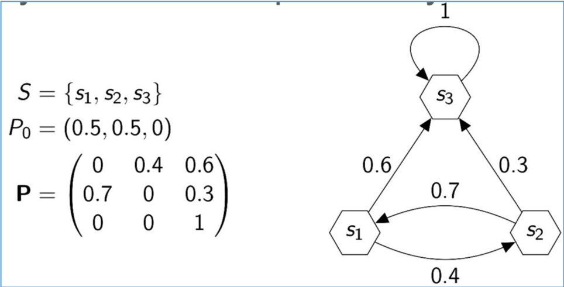

이 포스트는 pattern recognition and machine learning (bishop) chapter 11. sampling methods 를 기반으로 작성 되었음을 밝힙니다.

# 배경

“What is sampling? Sampling is the act, process, or technique of selecting a suitable sample, or a representative part of a population for the purpose of determining parameters or characteristics of the whole population.”

샘플링은 전체 집단의 대표적인 부분을 선택하는 방법으로써, 전체 집단의 특성을 결정하는 목적으로 사용된다. 

예를 들어, 전세계의 남자/여자 분포를 모른다면, 각국의 사람들을 골고루 뽑아 남녀가 나온 횟수를 비교해보면 전세계 남녀 분포를 가늠해볼 수 있다. 또한, 기대값을 계산하기 어려운 경우, 샘플링을 통해 얻은 값으로 대략적인 평균값을 구해볼수도 있다.

$$
E(f)=\int{p(z)f(z)dz}=\sum{f(z_i)}
$$

# 소개

샘플링의 목적은 원하는 분포 $p$ 로 부터 샘플 $z$ 을 생성하는것이다 $z \sim p(z)$. 특히 관심을 갖는 $z$ 는 고차원 샘플이다. 

고차원 domain 분포 $p$ 를 알고 있다면, 우리는 특정 $z_0$ 에 대한 $p(z_0)$ 의 값을 쉽게 계산할수 있다. 그럼에도 $p$ 로 부터 샘플을 추출하는것은 간단하지 않다.

샘플링에는 몇가지 방법들이 있는데, 우선 uniform(0,1) 로 부터 pseudo-random number를 생성할수 있다고 가정한다. 또한, $\hat{p}(z) = z_p p(z)$ 이다.

## 딥러닝을 이용한 샘플링 기법

<p align="center"> 
 
<center>Ref. 1</center>
</p>

Generative adversarial network (GAN)은 비교적 최근 고안된 이미지 생성 기법이다. uniform 분포로 부터 샘플된 랜덤 벡터 $z$ 를 입력으로 하여 학습된 네트워크 Gererator $G$ 를 통과하면 랜덤한 이미지 $x$ 가 생성되는데, 네트워크는 $z$ 에서 $x$ 로 매핑되는 함수 $G(z)=x$ 를 학습하게 된다 (Transformation technique). 

주목할 점은, Generator의 학습을 돕기위해 Discriminator $D$ 라는 또 다른 네트워크도 함께 학습한다. $D$ 의 역할은 $G$ 가 생성한 이미지와 실제 이미지중 어떤 것이 실제 이미지 인지를 구별하는데, 만약 구별이 너무 쉽다면 $G$ 를 혼내준다 (?!). 즉, $G$ 가 실제 이미지와 구별하기 힘든 그럴싸한 생성 이미지를 만들도록 강제한다. 

$G$ 와 $D$ 간의 대립, 경쟁 (adversarial) 을 모델링한 loss 함수 덕분에, 매우 그럴싸한 생성 이미지를 만들어낸다. 만약 $D$ 가 없어서 $G$ 가 경쟁을 하지 않는다면, 이미지와 같은 고차원의 샘플을 그럴싸하게 만들기 전에 대충 만들어버리는것에 안주 할지 모른다.

## 기본적인 샘플링 방법

원하는 분포 $p$ (desired distribution) 가 복잡하여, 샘플을 직접 추출하는것이 불가능 한 경우 사용할 수 있는 방법들이다.

### Transformation technique

쉽게 샘플링 할 수 있는 분포 (예를 들어, uniform)에서 추출한 샘플 $z$ 을 변환하여 원하는 분포 $p$ 의 샘플을 얻는 방식이다. 앞서 봤던 GAN이 이 방법으로 이미지 $x$ 를 생성한다. 즉, uniform 분포에서 샘플링한 $z$ 를 학습한 네트워크 $G$ 에 입력하고, 변환된 $G(z)=x$ 는 우리가 원하는 분포에서 얻는 샘플이 된다 $x~p(x)$.

이때, $x$ 또한 확률 랜덤 변수인데 이는 랜덤 변수 $z$ 로부터 변환됬기 때문이다.

### Rejection sampling

마찬가지로 쉽게 샘플링 할 수 있는 분포 (proposal distribution)에서 샘플을 추출한다. 하지만, 이번에는 몇몇 샘플들이 거부 (reject) 될 수 있다.

Rejection sampling의 간단한 예를 보자. 주사위를 던졌을 때의 값 1~6 을 uniform으로 샘플링 하고자 한다. 하지만 우리에게 주사위는 없고 동전 하나만 가지고 있다고 하자. 

동전을 세번 던져서 나오는 세 쌍 (예를 들어, 앞-앞-앞)의 모든 경우의 수는 8개 이다 (각 경우는 uniform이라 가정). 여기서 앞-앞-앞 과 뒤-뒤-뒤 가 나오는 경우를 거부/무시 (reject) 하면 총 6가지 경우만 남고, 6가지 각각에 값 1~6 을 매핑하면 주사위 값을 샘플링 하는 것과 같다. 

즉, reject는 어떠한 이벤트가 일어날 확률이 0인 것 과는 달리, 일어날 수 있지만 그 이벤트를 무시하는 것이다.

#### 방법

원하는 분포 $p(z)$ (desired distribution) 에 대해 다음을 선택한다:
- 직접 샘플링 가능한 분포 proposal distribution $q(z)$
- 모든 $z$ 에 대해 $kq(z) >= p(z)$ 인 상수 $k$

알고리즘:
1. $q$ 로 부터 $z_0$ 를 샘플링 한다.
2. uniform(0,$kq(z_0)$)로 부터 $u_0$ 를 샘플링 한다.
3. 만약 $u_0$ > $p(z_0)$ 이면 샘플 ($z_0, u_0$) 거부, 아니면 저장한다.

$u_0$ 가 거부 되는 경우를 제하면 $u$ 는 uniform(0,$p(z)$) 를 따르게 되어, ($z_0, u_0$) 쌍 $S$ 은 $p(z)$ 아래에서 uniform으로 분포한다

$S(u,z)=p(z)/u=p(z)/p(z)=1$.

따라서, $u$를 marginal 하면 $S(z)=p(z)$ 분포를 따른다. 즉, 저장된 쌍 ($z_0, u_0$) 의 $z_0$ 는 $p(z)$ 를 따르는 샘플이다. 

이 알고리즘이 가능한 이유는 $p$ 에서 샘플 추출은 어려울지라도, $p$ 에서의 특정 $z_0$ 값 $p(z_0)$ 을 계산하는것은 가능하기 때문이다.

#### 한계

거부될 가능성은 $k$ 에 따라 크게 달라진다. 따라서, $k$ 는 최대한 작으면서 $p(z)$ 보다는 모든 $z$ 에서 항상 크도록 정해야 한다.

$$\begin{aligned} p(\text { accept }) =\int{[p(z) / k q(z)]} q(z) \mathrm{d}z \\ &=\frac{1}{k} \int p(z) \mathrm{d} z
\end{aligned}$$

그러나 k를 최적으로 정한다 해도 z의 차원이 커질수록 거부 가능성은 기하급수적으로 증가한다.

예를 들어, desired distribution (p)과 proposal distribution (q) 모두 다변량 가우시안을 따른다고 하자. 

$p \sim MN(0,sI_1), q \sim MN(0,sI_2)$. 

가우시안의 꼬리 (tail)에서도 항상 크기위해 $sI2 > sI1$ 이여야 한다. 끝으로 q가 항상 p보다 크기 위해서는 q(0) > p(0) 이기만 하면 된다. 즉,

수식

k의 값이 차원에 따라 기하급수적으로 증가함에 따라, 거부 가능성 또한 기하급수적으로 증가한다. 즉, 고차원의 데이터를 샘플링하는데에는 매우 비효율적이다.

## Markov chain Monte carlo (MCMC)

MCMC는 고차원의 데이터 추출도 잘 할 수 있는 샘플링 기법이다.

rejection sampling과 같이 직접 샘플 추출 가능한 proposal distribution $q$ 에서 샘플링을 한다. 하지만 차이점은 샘플링했던 값 $z_t$을 기준으로 다음 샘플 $z_{t+1}$ 을 추출 한다는 점이다:

$z \sim q(z_{t+1}|z_t)$

이런 방식으로 샘플링한 sequence $z_1,z_2,..,z_t$ 는 Markov 'chain'을 이룬다고 한다.

의문점은 이런식으로 얻은 샘플 $z \sim q(z|z_t)$ 들은 원하는 분포 $p$ 에서 얻은 샘플이 아니라는 것이다. 그러나 Markov chain이 $p$ 에 대해 '특정 조건'을 만족하면, 연속적으로 의존하는 샘플들이 원하는 분포 $p$ 를 따르게 된다.

### Metropolis algorithm

Metropolis algorithm 는 MCMC 기법중 하나이다. proposal distribution에서 '후보' 샘플 $z^{\star} \sim q(z^{\star}|z_t)$을 추출한다. 후보 $z^{\star}$ 는 다음의 기준에 따라 샘플로써 저장될수도 있고 버려질수도 있다.

수식

수식을 자세히 보면, 새롭게 샘플링된 값 $z^{\star}$ 에서의 desire distribution 값 $p(z^{\star})$ 이 클수록 저장 될 가능성이 커지며, $p(z^{\star}) \geq p(z_t)$ 이면 100% 저장된다. 직관적으로, 원하는 분포의 확률이 큰 곳의 샘플을 저장하는것이 자연스럽다.

만약 proposal distribution $q$ 가 positive 이고 symmetric이면:
- $q(z_A \mid z_B) = q(z_B \mid z_A)$ (symmetric)
- $q(z_A \mid z_B) > 0$, for all $z_A, z_B$ (positive)

Markov chain 에 의해 얼마 후 $z \sim p(z)$ 를 따르게 된다.

<p align="center"> 
 
<center>Ref. 1</center>
</p>

Metropolis algorithm이 Markov chain을 따라 샘플을 추출하는 동선. 검은색 타원을 잇는 선은 원하는 분포 $p: z \sim N(\mu,\Sigma)$ 의 one standard-deviation contour 이다. 

proposal distribution $q: z^{\star} \sim N(z_t,\sigma^2I)$ 는 현재 위치 $z_t$ 를 기준으로 후보 샘플 $z^{\star}$ 을 생성하며, criterion 에 의해 $z^{\star}$ 가 accept (초록색 선) 혹은 reject (빨간색 선) 된다.

그림에서 보듯 $z^{\star}$ 가 $p$ 의 contour를 벗어나면 reject 되는 경우가 많은데, 이는 $p(z^{\star}) < p(z_t)$ 이기 때문이다.

## Markov chain

원하는 분포 $p$ 로 수렴하는 조건에 대해 설명 하기에 앞서 Markov chain에 대해 알아보자.

(first-order) Markov chain 은 연속적인 랜덤 변수들 $z_1,z_2,..z_m$ 로 정의되며, 이전 시간에 일어난 사건 $z_{t-1}$ 에 대해서만 현재 어떤 사건 $z_t$이 일어날지 결정되는 확률 모델이다. 

$p(z_t \mid z_1,z_2,..,z_{t-1}) = p(z_t \mid z_{t-1})$

또한, 연속적인 Markov chain 랜덤 변수들 $z_1,z_2,..z_m$ 은
- 초기 확률 분포: $p_0(z)$
- 전이 확률 분포: $T(z_t,z_{t+1}) \equiv p(z_{t+1} \mid z_t)$

에 따라 결정 된다.

### Markov chain in discrete states

Markov chain 이 이산적인 상태 공간에서 어떻게 생성되는지 살펴보자.

<p align="center"> 
 
<center>Ref. </center>
</p>

위 그림에서 가능한 상태는 $S={s_1,s_2,s_3}$ 는 총 세 개 이며, 초기 상태 $p_0$ 확률 그리고 전이 확률 $P$ 이 주어진다. 전이 확률은 Metropolis algorithm 에서 봤던 $q(z|z_t)$ 와 유사한 개념이다.

그렇다면 $n$ 번 이동을 한 후의 확률 분포 $p_n$ 는 어떻게 될까? 

$P_n=P^{n} \times P_0=(0,0,1)$

에 점점 가까워진다. 즉, 특정 분포에 수렴 한다 (stationary 분포). 또한, 다른 초기 상태 $P_0$ 에서 시작한다고 하더라도 stationary 분포에 수렴한다. 

사실 이 간단한 예에서 $s_3$ 상태는 머물 확률이 1 (absorbing state) 이기 때문에, 어떤 상태에서 출발해도 s3에 갇히게 된다 (absorbing Markov chain).

<p align="center"> 
 
<center>Ref. </center>
</p>

위 그림의 가능한 상태 $S$ 은 두개이며 초기 확률 분포 $p_0$ 가 주어졌을 때, 특정 분포 $p^{\star}=[0.3636.., 0.6363..]$ 로 수렴하는 것을 확인할 수 있다. 또한, 초기 확률 분포와 관계없이 동일한 $p^{\star}$ 로 수렴하는 것을 계산해볼 수 있다.

따라서 Markov chain 이 원하는 분포로 수렴하도록 설계하면, 그 분포로 부터 샘플들을 얻을 수 있을 것이다. 그렇다면 어떤 조건일때, 초기 확률 분포와 무관하게 특정 분포로 수렴하게 될까?

### Markov chain in general

만약 모든 시간 $t$ 에서 전이 확률이 동일하다면, 그 Markov chain을 ```(time) homogeneous``` 라 한다. homogeneous Markov chain 의 특징은 $t \rightarrow \infty$ 일때, 특정 stationary 분포로 수렴한다는 것이다.

만약 Markov chain 의 이동에도 $p^{\star}(z)$ 가 바뀌지 않는다면, $p^{\star}$ 는 그 Markov chain에 대해 ```invariant``` (stationary) 분포라고 한다.

$p^{\star}(\mathbf{z})=\sum_{\mathbf{z}^{\prime}} T\left(\mathbf{z}^{\prime}, \mathbf{z}\right) p^{\star}\left(\mathbf{z}^{\prime}\right)$

$p^{\star}$ 가 아니라면, 전이 확률에 의해 분포가 $\hat{p}$ 등으로 변할 것이다.

### 수렴 조건

원하는 분포가 invariant 분포 이기 위한 Markov chain 의 충분 조건은, Markov chain의 전이 확률이 원하는 분포에 대해 ```detailed balance``` 를 만족하는 것이다:

$$
p^{\star}(\mathbf{z}) T\left(\mathbf{z}, \mathbf{z}^{\prime}\right)=p^{\star}\left(\mathbf{z}^{\prime}\right) T\left(\mathbf{z}^{\prime}, \mathbf{z}\right)
$$

<p align="center"> 
 
<center>Ref. </center>
</p>

위의 예에서 전이 확률 $T$ 가 분포 $p^{\star}$ 에 대해 detailed balance를 만족함을 계산할수 있다. 

$$
p^{\star}(E)T(E,A)=p^{\star}(A)T(A,E)=0.3636..\times0.7=0.6363..\times0.4
$$

따라서, $p^{\star}$ 는 위 Markov chain의 invariant 분포이다. detailed balance는 각 상태에서 전이되는 확률이 균형 (balance) 을 이뤄, 분포가 변하지 않는 (invariant) 특성을 말한다.

목표는 Markov chain을 이용하여 원하는 분포에서 샘플들을 얻는 것이다. 따라서, 원하는 분포가 우리가 설계한 Markov chain에 대해 invariant 분포이면 된다. 또한, Markov chain이 초기 분포에 상관없이 원하는 분포로 도달해야 한다 (ergodicity).

homogeneous markov chain의 전이 확률 $T$ 이 원하는 분포에 대해 detailed balance를 만족하면, markov chain은 원하는 분포로 수렴한다:

1. homogeneous markov chain 특성에 의해, 초기 확률 분포와 관계없이 특정 stationary 분포 $d$ 가 존재한다.
2. $p^{\star}$ 는 detailed balance에 의해 invariant 하다.
3. (2) 에 의해, 초기 확률이 $p^{\star}$ 였어도 Markov chain은 $p^{\star}$ 로 수렴할 것이다.
4. (1) 에서 초기 확률에 관계없이 unique한 분포로 수렴하므로, $d=p^{\star}$ 이다.

위 증명은 몇가지 invariant 분포 및 전이 확률에 대한 조건이 생략됨.

### Metropolis algorithm (revisit)

homogeneous Markov chain의 전이 확률 (proposal distribution) $q(z^{\star} \mid z_t)$ 이 symmetric 이며, criterion 에 의해 accept 되므로 원하는 분포에 대해 detailed balance를 만족한다:

$$
p^{\star}(z^{\star}) min() q(z^{\star} \mid z_t) = p^{\star}(z^{\star}) min() q(z_t \mid z^{\star}) = p^{\star}(z_t) min() q(z_t \mid z^{\star})
$$

따라서, Metroplis algorithm 은 원하는 분포 $p$ 로 수렴한다.

한가지 생각할 점은 인접한 샘플들끼리는 독립이 아니라는 것이다. 따라서, 일정 간격을 두고 sub-sampling 하여야 어느정도 독립적인 샘플들을 얻을 수 있다.

### Random walk behavior

독립적인 샘플을 얻기 위해 필요한 step?

### Metropolis-Hastings algorithm


# Reference

1. bishop, Pattern recognition and machine learning