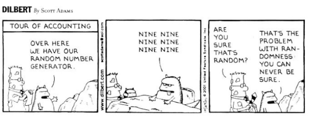
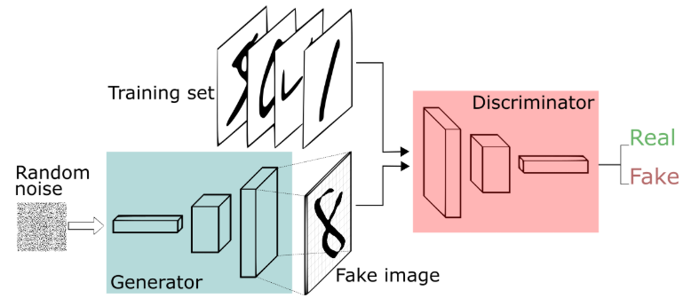
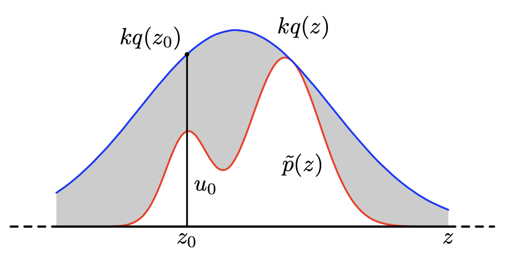

이 포스트는 Bishop, pattern recognition and machine learning, chapter 11. sampling methods 를 기반으로 작성 되었습니다.

### Random 이란?

 
 

Ref. 5

# Basic sampling

 
 

Ref. 4

“What is sampling? `Sampling` is the act, process, or technique of selecting a suitable sample, or a `representative` part of a population for the purpose of determining parameters or `characteristics` of the whole `population`.”

샘플링은 전체 집단의 대표적인 부분을 선택하는 방법으로써, 전체 집단의 특성을 결정하는 목적으로 사용된다. 

예를 들어, 전세계의 남자/여자 분포를 모른다면, 각국의 사람들을 골고루 뽑아 남녀가 나온 횟수를 비교해보면 전세계 남녀 분포를 가늠해볼 수 있다. 

또한, 함수 $f(z)$ 의 기대값을 계산하기 어려운 경우, 샘플링을 통해 얻은 값 $z_1,z_2,..,z_L$ 으로 대략적인 평균값을 구해볼 수도 있다:

$$
\begin{aligned}
E(f)&=\int{p(z)f(z)dz} \\ \\
&\approx \frac{1}{L}\sum_{i=1}^{L}{f(z_i)} \\
\end{aligned} 
$$

따라서, 샘플링은 target 분포 $p$ (전체 집단) 로 부터, (대표적인) 샘플 $z_1,z_2,..,z_N$ 을 생성하는것이다:

$$
z \sim p(z)
$$ 

특히 관심을 갖는 $z$ 는 고차원 샘플이다. 

고차원 분포 $p(z)$ 를 알고 있다면, 특정 $z_0$ 에 대한 $p(z_0)$ 의 값을 쉽게 계산할수 있다. 그럼에도 $p$ 로 부터 샘플을 추출하는것은 간단하지 않다.

샘플링에는 몇가지 방법들이 있는데, 우선 uniform(0,1) 로 부터 pseudo-random number를 생성할 수 있다고 가정한다.

### 딥러닝을 이용한 이미지 (고차원 데이터) 샘플링

 
 

Ref. 2

Generative adversarial network (GAN)은 비교적 최근 고안된 이미지 생성 기법이다. uniform 분포로 부터 샘플된 랜덤 노이즈 $z$ 를 입력으로 하여, 학습된 네트워크 Gererator $G$ 를 통과하면 랜덤한 이미지 $\hat{x}$ 가 생성된다. 네트워크는 $z$ 에서 $\hat{x}$ 로 매핑되는 함수 $G(z)=\hat{x}$ 를 학습한다 (이때, 랜덤변수 $z$ 에 의해 생성된 이미지 $\hat{x}$ 도 랜덤변수 이다).

재밌는 점은, Generator의 학습을 돕기위해 Discriminator $D$ 라는 또 다른 네트워크도 함께 학습한다. $D$ 의 역할은 $G$ 가 생성한 이미지 $\hat{x}$ 와 실제 이미지 $x$ 중 어떤 것이 실제 이미지 인지를 구별하는데, 만약 구별이 너무 쉽다면 $G$ 를 혼내준다 (?!). 즉, $G$ 가 실제 이미지와 구별하기 힘든 그럴싸한 생성 이미지를 만들도록 강제한다. 

$G$ 와 $D$ 간의 대립, 경쟁 (adversarial) 을 모델링한 loss 함수 덕분에, 매우 그럴싸한 생성 이미지를 만들어낸다. 만약 $D$ 가 없어서 $G$ 가 경쟁을 하지 않는다면, 이미지와 같은 고차원의 샘플을 그럴싸하게 만들기 전에 대충 만들어 버리는 것에 안주 할지 모른다.

## 기본적인 샘플링 방법

target 분포 $p$ (샘플링 하고자 하는 분포) 가 복잡하여, 샘플을 직접 추출하는것이 불가능한 경우 사용할 수 있는 방법들이다.

## Transformation technique

쉽게 샘플링 할 수 있는 분포 $q$ 에서 추출한 샘플 $z \sim q(z)$ 을 변형하여 (transformation):

$$
G(z)=x
$$

target 분포 $p$ 의 샘플 $x \sim p(x)$ 을 얻는 방식이다. 앞서 봤던 GAN 이 transformation 방법으로 이미지를 생성한다.

 
 

Ref. 9

GAN (Generator vs Discriminator) 이 경쟁적으로 학습되는 과정. 

검은색 점선은 실제 이미지 $x$ 분포, 초록색 선은 생성된 이미지 $\hat{x}$ 분포, 파란색 점선은 Discriminator $D$ (값이 클수록 실제라고 판단) 이다. $z$ 에서 $x$ 로 가는 화살표들은, $G$ 에 의한 랜덤변수 $z$ 의 transformation 을 나타낸다.

- (a): uniform 분포에서 샘플링한 랜덤벡터 $z$ 가, 학습되기 전 네트워크 $G_0$ 에 입력됨. 생성된 이미지 $G_0(z)=\hat{x}$ 는 실제 이미지 $x$ 와 같은 domain 에서 분포를 갖지만, 실제 이미지와는 거리가 멀다 (초록선과 검은점선의 거리가 멈).
- (b): Discriminator $D$ 가 실제와 생성 이미지를 구분하도록 학습됨 (파란점선의 값으로 초록선과 검은점선을 구분할 수 있음).
- (c): $D$ 가 쉽게 구분하지 못하도록, $G$ 는 실제 이미지와 유사한 이미지를 생성하도록 학습됨 (초록선과 검은점선의 거리가 가까워짐).
- (d): 학습이 충분히 되어 $z \rightarrow x$ 의 transformation 함수 $G$ 를 찾아내면, 생성 이미지 $G(z)=\hat{x}$ 는 실제 이미지와 유사해짐 (파란점선이 초록선과 검은점선을 더 이상 구분할 수 없음).

많은 학습 데이터와 컴퓨팅 파워를 바탕으로, GAN 은 실제 이미지 같은 고차원 데이터를 샘플링 할 수 있음을 보였다. 

그러나 고차원에서 고차원으로 매핑하는 매우 복잡한 transformation 함수 $G: z \rightarrow x$ 를 성공적으로 학습시키기는 여전히 쉽지 않다.

## Rejection sampling

마찬가지로 쉽게 샘플링 할 수 있는 분포 (proposal 분포)에서 샘플을 추출한다. 하지만, 이번에는 몇몇 샘플들이 거부 (reject) 될 수 있다.

또한, target 분포 $p$ 를 전체확률 1로 normalize 하기 전인 $\tilde{p}$ 까지만 안다고 해도 ($Z_p$ 를 계산할 수 없어서), 샘플링이 가능하다:

$$
p(z)=\frac{1}{Z_p}\tilde{p}(z)
$$

즉, 모든 $z$ 에 대해서 $\tilde{p}(z)$ 만 계산할 수 있으면 rejection sampling 을 사용할 수 있다.

Rejection sampling 에 앞서 rejection 이 확률에 미치는 예를 보자.

 
 

> 주사위를 던졌을 때의 값 1-6 을 uniform 샘플링 하고자 한다. 하지만 주사위는 없고 동전 하나만 가지고 있다고 하자. 동전을 세번 던져서 나오는 세 쌍 (예를 들어, 앞-앞-앞)의 모든 경우의 수는 8개 이다. 
여기서 앞-앞-앞 과 뒤-뒤-뒤 가 나오는 경우를 거부 (rejection) 하고 다시 던지도록 하면 총 6가지 경우만 남는다. 6가지 각각에 값 1-6 을 매핑하면 주사위 값을 샘플링 하는 것과 같다.

즉, rejection 은 일어날 수 있는 event 를 무시함으로써 다른 event 들의 확률을 높인다.

### Rejection sampling 알고리즘

target 분포 $p(z)$ 에 대해 다음을 선택한다:
- 직접 샘플링 가능하고, target 분포와 유사한 proposal 분포 $q(z)$
- 모든 $z$ 에 대해, $\tilde{p}(z) \leq kq(z)$ 를 만족하는 상수 $k$

알고리즘:
1. $z_0 \sim q(z)$ ($z_0$ 샘플링)
2. $u_0 \sim uniform(0,kq(z_0))$ ($u_0$ 샘플링)
3. $u_0 \leq \tilde{p}(z_0)$ 이면 $(z_0,u_0)$ 의 $z_0$ 를 target 분포의 샘플로써 저장, 아니면 버림 (reject)

 
 

Ref. 1

위 그림의 회색 부분 $\tilde{p}(z_0) < u_0$ 의 $(z_0, u_0)$ 쌍은 버려지므로, $(z_0,u_0)$ 는 $\tilde{p}(z)$ 그래프 아래에서 균일하게 분포한다. 따라서, 알고리즘으로 생성된 $z_0$ 들은 target 분포 $p(z)$ 를 따라 생성된다. 왜냐하면 $p(z)$ 가 큰 위치 $z$ 일수록 저장될 가능성이 커서, 더 많이 샘플링 되기 때문이다 (증명은 Ref. 1, Exercise 11.6 참고).

이 알고리즘으로 샘플링이 가능한 이유는 $p$ 에서 직접 샘플 추출은 어려울지라도, 특정 $z_0$ 에서 $\tilde{p}(z_0)$ 을 계산하는것은 가능하기 때문이다.

### Acceptance 확률

rejection sampling 으로 $z_0$ 가 저장 (accept) 될 확률은 $q$ 에서 $z_0$ 가 뽑히면서, 동시에 $u_0 \leq \tilde{p}(z_0)$ 이여서 $(z_0,u_0)$ 가 accept 될 확률이다:

$$
\begin{aligned}
P(\text{accept}\mid z_0)\; q(z_0) &= P(u_0 \leq \tilde{p}(z_0))\; q(z_0) \\ \\
&=\frac{\tilde{p}(z_0)}{kq(z_0)} q(z_0) \\ \\
&= \frac{\tilde{p}(z_0)}{k}
\end{aligned}
$$

따라서, 모든 $z$ 에 대한 accept 확률은 다음과 같다:

$$
\begin{aligned}
P(\text { accept }) &= \int{P(\text{accept}\mid z)q(z) }dz \\ \\
&=\frac{1}{k} \int {\tilde{p}(z)} dz \\
\end{aligned}
$$

accept 확률과 $k$ 는 반비례 한다. 여기서 $\tilde{p}(z)$ 는 주어지는 것이고, $k$ 를 최대한 작게 선택해야 accept 확률을 높일 수 있다. 단, 모든 $z$ 에서 $\tilde{p}(z) \leq kq(z)$ 를 만족해야 rejection sampling 을 사용할 수 있다.

### 한계

문제는 $k$ 를 최소한으로 선택한다고 해도, 샘플링 하고자 하는 $z$ 의 차원이 크면 accept 가능성은 기하급수적으로 감소한다.

 
 

Ref. 6

예를 들어, target 분포 $p$ 가 다변량 가우시안 분포 $N(0,\sigma_p^2 I)$ 를 따른다고 하고, 운 좋게 proposal 분포 $q$ 를 동일하게 다변량 가우시안 분포 $N(0,\sigma_q^2 I)$ 로 정했다고 하자 $(\; \sigma_p^2 \neq \sigma_q^2\;)$. 이때, 가우시안의 꼬리 (tail) 에서도 항상 $p(z) \leq kq(z)$ 인 $k$ 가 존재하기 위해서는 반드시 $\sigma_q^2 > \sigma_p^2$ 이여야 한다 (왜냐하면 상수곱으로 지수적 차이를 극복할 수 없으므로).

그리고 $p(0) \leq kq(0)$ 인 $k$ 를 찾으면, 모든 $z$ 에서 $p(z) \leq kq(z)$ 이다. 즉, 최적의 $k$ 는

$$
\begin{aligned}
\text{optimal } k &= \frac{p(0)}{q(0)} = \frac{\Sigma_q}{\Sigma_p} = \left(\frac{\sigma_q^2}{\sigma_p^2}\right)^D.

\end{aligned}
$$

$\sigma_q^2 > \sigma_p^2$ 이기 때문에, $k$ 의 값이 차원 $D$ 에 따라 기하급수적으로 증가하며, 그에 따라 샘플이 reject 될 가능성 또한 기하급수적으로 증가한다. 만약 target 분포와 proposal 분포가 다른 형태라면 reject 가능성이 더욱 커질 것이다. 

따라서, rejection sampling 은 고차원의 데이터를 샘플링 하는데는 비효율적이다. 

# Reference

1. Bishop, Pattern recognition and machine learning
2. https://pathmind.com/kr/wiki/generative-adversarial-network-gan
3. https://math.stackexchange.com/questions/2923979/what-is-the-proof-guarantee-that-metropolis-hastings-converge-to-our-required
4. http://www.jollybus.kr/ai/2019/05/02/introduction-to-sampling-methods/
5. https://www.slideshare.net/TomaszKusmierczyk/sampling-and-markov-chain-monte-carlo-techniques?from_action=save
6. https://en.wikipedia.org/wiki/Wrapped_normal_distribution
7. https://en.wikipedia.org/wiki/Markov_chain
8. http://www2.math.uu.se/~sea/kurser/stokprocmn1/slumpvandring_eng.pdf
9. https://arxiv.org/pdf/1406.2661.pdf