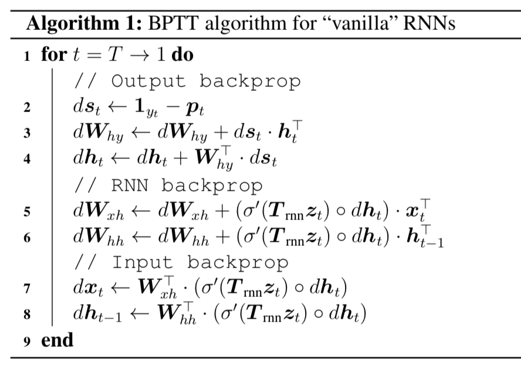

# RNN

 
 

http://karpathy.github.io/2015/05/21/rnn-effectiveness/

For example, the model opens a \begin{proof} environment but then ends it with a \end{lemma}. This is an example of a problem we’d have to fix manually, and is likely due to the fact that the dependency is too `long-term`.

 
 

https://github.com/tensorflow/nmt

# LSTM

매 프레임 forget, input, output (input: [h,x], sigmoid output: 0~1 값) gate 세개를 생성하고, cell state에 대해 정보를 제거 (forget), 추가 (input), 출력 (output) 한다. 

# Backpropagation through time (BPTT)

 
 

https://www.coursera.org/lecture/nlp-sequence-models/backpropagation-through-time-bc7ED

RNN training시 x와 이전 프레임에서 계산된 a가 input으로 사용된다.

a는 프레임을 계속 지나치며 값이 갱신되므로, back-propagation 시에도 마찬가지로 이전 프레임으로 오류를 전파해야 한다.

이러한 RNN에서 사용되는 back-propagation을 Backpropagation through time (BPTT) 라고 한다.

 
 

https://www.coursera.org/lecture/nlp-sequence-models/backpropagation-through-time-bc7ED

매 프레임마다 loss가 생기며 이러한 loss들의 합이 전체 loss가 된다.

RNN의 weight는 모든 시간에 대해서 공유하여 사용하기 때문에, loss에 의한 update를 아래 Algorithm과 같이 계속 누적시킨다.

 
 

https://github.com/lmthang/thesis/blob/master/thesis.pdf

알고리즘 관련 특이사항:

- Line.1 에서, for t=T–>1 이므로, 맨 마지막 시점부터 루프가 시작됨.
- Line.8에서 얻은 값 dh_(t-1) 은 다음 루프 t-1에서 dh_t가 되며, Line.4 에서 현재 update와 더해져서 누적된다.
- Line.3의 dW_hy의 경우, 현재의 output에만 영향을 미치는 weight 이기 때문에, 오류가 시간에 따라 역전되는 dh 계산에는 포함되지 않는다.

# Conditional mask

 
 

https://simonjisu.github.io/paper/2020/07/19/maskpredict.html

 
 

https://www.tensorflow.org/about

# 용어

정제 (cleaning)
정규화 (normalization)
불용어 (stopword)
어간 추출 (stemming)
표제어 추출 (lemmatization)
정규 표현식 (regular expression)
토큰화 (tokenization)

# word2vec

각 문장에서 가까이 함께 자주 나오는 단어들을 임베딩 벡터 차원에서 유사하도록 학습. 즉, 함께 나온 단어끼리 내적하여 값이 크도록 하고, 그렇지 않은 단어들끼리는 내적값이 작도록 학습한다.

 
 

https://towardsdatascience.com/word2vec-skip-gram-model-part-1-intuition-78614e4d6e0b

skip-gram (W와 W' 매트릭스) 학습 과정 (negative sampling):
- W 매트릭스에서 input index의 벡터를 가지고 옴 ($W_i$)
- W' 매트릭스에서 `positive` output index (input 주변의 단어들) 의 벡터를 가지고 옴 ($W'_j$)
- W' 매트릭스에서 `negative` output index (negative sampled) 의 벡터를 가지고 옴 ($W'_k$)
- (i, j)는 positive 이므로, $W_i$와 $W'_j$ 의 내적 값이 크도록 학습 ($W_i$와 $W'_j$ 값 조정)
- (i, k)는 negative 이므로, $W_i$와 $W'_k$ 의 내적 값이 작도록 학습 ($W_i$와 $W'_k$ 값 조정))

 
 

'ㅋ'와 유사한 것들

질문: 왜 W와 W' 의 가중치를 공유하여 학습하지 않는가??

# Metrics
perplexity, cross entropy, KL divergence, BLEU, CTC