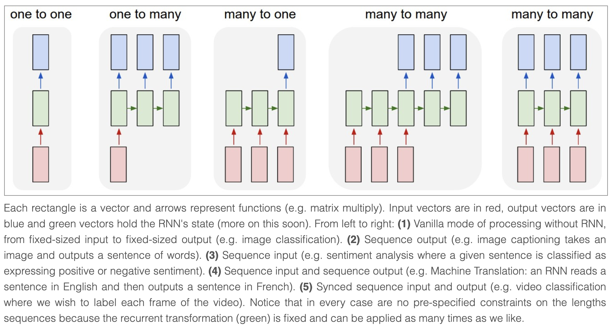
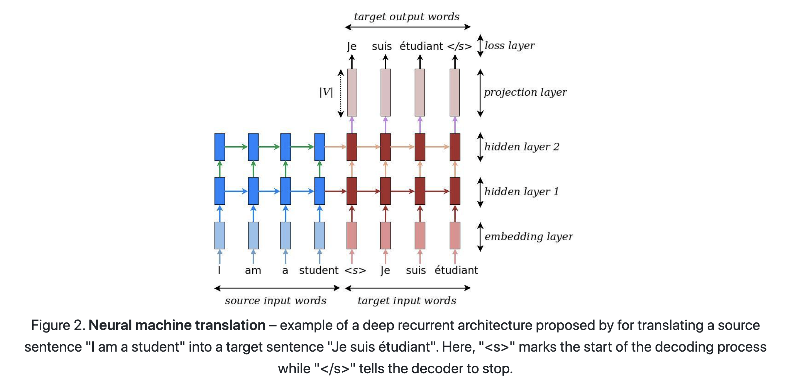
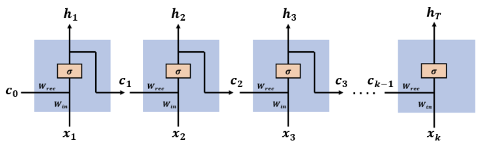
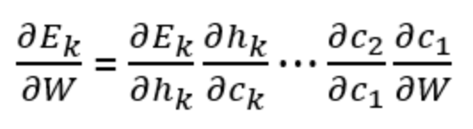
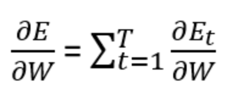
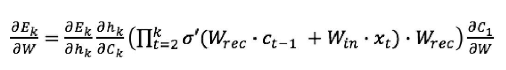
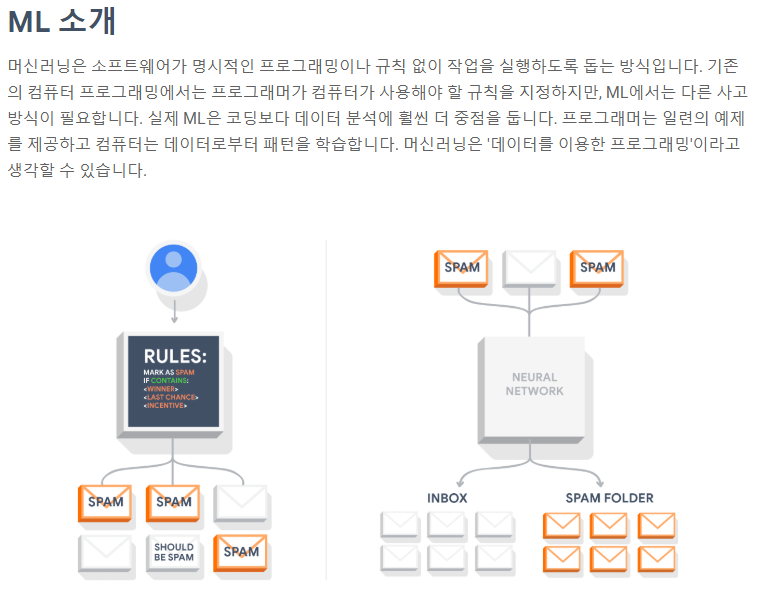
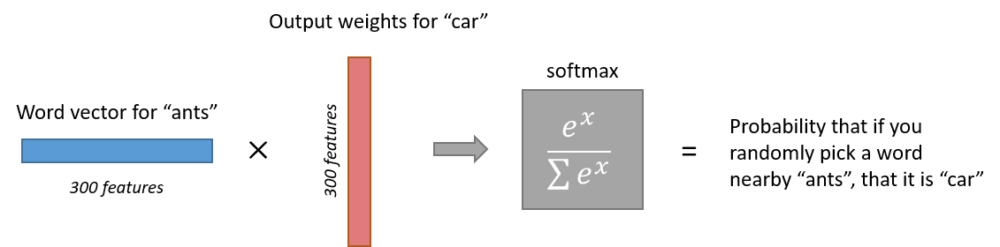
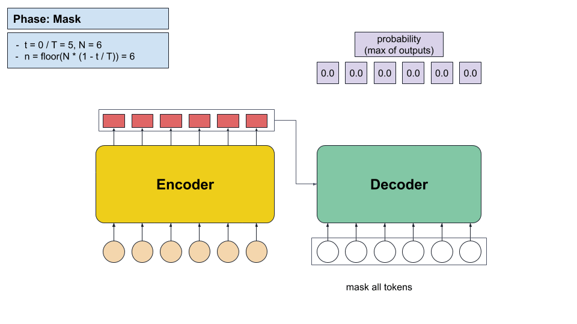
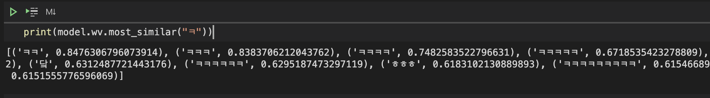

# RNN

유닛 간의 연결이 순환적 구조. 내부에 상태를 `저장`하고, sequence 입력을 처리 $h_t = tanh(W_hh_{t-1}+W_ex_t)$

 
 

http://karpathy.github.io/2015/05/21/rnn-effectiveness/

[source](http://karpathy.github.io/2015/05/21/rnn-effectiveness/): For example, the model opens a `\begin{proof}` environment but then ends it with a `\end{lemma}`. This is an example of a problem we’d have to fix manually, and is likely due to the fact that the dependency is too long-term.

 
 

https://github.com/tensorflow/nmt

[source](https://pytorch.org/tutorials/intermediate/seq2seq_translation_tutorial.html): Unlike sequence prediction with a single RNN, where every input corresponds to an output, the seq2seq model frees us from sequence length and order, which makes it ideal for translation between two languages.

# Backpropagation through time

 
 
https://medium.com/datadriveninvestor/how-do-lstm-networks-solve-the-problem-of-vanishing-gradients-a6784971a577

 
 
??

 
 

각 시점에서 발생한 오류들을 누적

 
 

tanh 함수의 미분값 ($\sigma'$)들이 연달아 곱해져서 gradient vanishing.

# LSTM

추가 저장공간 (cell)을 가지며, forget (x), input (+), output 게이트로 cell 정보 흐름을 control. Forget gate를 통해, 역전파 기울기 소실 문제 해결 (먼 시점으로부터 학습 가능).

# Connectionist temporal classification (CTC)

분리되지 않은 (unsegmented) 시계열 데이터를 레이블링 하는 방법:
‘aaa’, ‘a-a’

# Transformer

RNN, LSTM 의 순차적,순환적 처리 대신 병렬적으로 시계열 데이터 처리.
Feed-forward와 attention (+self-attention) 만을 이용한 sequence 입력 처리 구조. Attention을 통한 direct 정보 접근.

# Machine learning?

 
 

https://www.tensorflow.org/about

# NLP 용어

- 정제 (cleaning)
- 정규화 (normalization)
- 불용어 (stopword)
- 어간 추출 (stemming)
- 표제어 추출 (lemmatization)
- 정규 표현식 (regular expression)
- 토큰화 (tokenization)

# word2vec

각 문장에서 가까이 함께 자주 나오는 단어들을 임베딩 벡터 차원에서 유사하도록 학습. 즉, 함께 나온 단어끼리 내적하여 값이 크도록 하고, 그렇지 않은 단어들끼리는 내적값이 작도록 학습한다.

 
 

https://towardsdatascience.com/word2vec-skip-gram-model-part-1-intuition-78614e4d6e0b

skip-gram (W와 W' 매트릭스) 학습 과정 (negative sampling):
- W 매트릭스에서 input index의 벡터를 가지고 옴 ($W_i$)
- W' 매트릭스에서 `positive` output index (input 주변의 단어들) 의 벡터를 가지고 옴 ($W'_j$)
- W' 매트릭스에서 `negative` output index (negative sampled) 의 벡터를 가지고 옴 ($W'_k$)
- (i, j)는 positive 이므로, $W_i$와 $W'_j$ 의 내적 값이 크도록 학습 ($W_i$와 $W'_j$ 값 조정)
- (i, k)는 negative 이므로, $W_i$와 $W'_k$ 의 내적 값이 작도록 학습 ($W_i$와 $W'_k$ 값 조정))

질문: 왜 W와 W' 의 가중치를 공유하여 학습하지 않는가??

# Metrics

### Precision

$\frac{TP}{TP+FP}$
- Ground truth: `abc`
- Prediction: `abcde` 와 같이 길게 예측하면, false positive 인 `de` 에 의해 패널티
- Prediction: `ab` 와 같이 짧게 예측해도, false negative 인 `c` 가 무시되어 패널티를 받지 않음

### Recall

$\frac{TP}{TP+FN}$
- GT: `abc`
- prediction: `ab`와 같이 짧게 예측하면, false negative 인 `c` 에 의해 패널티
- prediction: `abcde` 와 같이 길게 예측해도, false positive 인 `de` 가 무시되어 패널티를 받지 않음

따라서 Precision & Recall 은 서로 상호보완적임.

### BLEU

Ground truth에 대한 Ngram (default:1~4) precision들의 기하 평균.
짧게 예측하면 precision은 영향을 받지 않으므로 brevity term으로 패널티를 줌.

### Perplexity

Language 모델이 주어진 실제 문장에 대해 당황한 정도.
낮을수록 좋은 모델.

### Cross entropy

실제 분포에 대해 모델링한 분포로 coding 했을때, 평균 bit 수.

$KL divergence(p,q) = Cross entropy(p,q) – Entropy(p)$

- 불필요한 평균 비트 수

### Mutual information

KL divergence( p(x,y), p(x)p(y) )

Y에 대해 알게 됬을때, x의 불확실성이 감소되는 정도 (x 정보량 감소)

<!-- # Conditional mask

 
 

https://simonjisu.github.io/paper/2020/07/19/maskpredict.html

 
 

'ㅋ'와 유사한 것들

 -->
